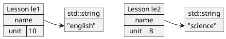
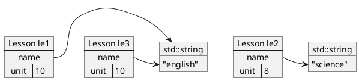
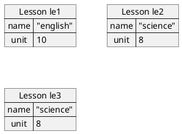

<!-- 
・このmarkdownファイルは、演習のHTMLファイルのソースドキュメントとなります。
・このmarkdownファイルはVisualStudioCodeのMarkdown Preview Enhanced拡張に最適化したものです。
・よってVisualStudioCodeを使ってこのmarkdownファイルからHTMLファイルを生成して下さい。
-->

# C/C++演習「知っとけ！メモリ操作」

```C {.line-numbers}
// お試し問題：以下の blank1～4 を埋めてください
#include <stdio.h>
// x + y => z
void add(int x, int y, /* blank1 */)
{
  /* blank2 */ = x + y;
}
void main()
{
  int a = 1;
  int b = 2;
  int /* blank3 */;
  add(a, b, /* blank4 */);
  printf("c=%d\n", c); // 期待する出力："c=3"
}
```

<div class="fig1">

```ditaa {cmd=true args=["-ESs1"]}
 HINT! stack area image at line 7.

   x            y             z
  +-------+    +-------+     +-------+
  |       |    |       |     |       |
  |   1   |    |   2   |  /------*   |
  |       |    |       |  |  |       |
  +-------+    +-------+  |  +-------+
--=-----------------------|-=-----------
   a            b         |   c 
  +-------+    +-------+  \->+-------+
  |       |    |       |     |       |
  |   1   |    |   2   |     |   3   |
  |       |    |       |     |       |
  +-------+    +-------+     +-------+
```
</div>

<!-- code_chunk_output -->

- [はじめに](#はじめに)
  - [背景・目的](#背景目的)
  - [前提条件](#前提条件)
  - [演習の準備](#演習の準備)
  - [演習の所要時間](#演習の所要時間)
- [１章 スコープ・ライフサイクル](#1章-スコープライフサイクル)
  - [1.1 スコープ](#11-スコープ)
  - [1.2 ライフサイクル、初期化](#12-ライフサイクル-初期化)
  - [1.3 知っとけ！](#13-知っとけ)
- [２章 ポインタ・配列](#2章-ポインタ配列)
  - [2.1 アドレス・ポインタ](#21-アドレスポインタ)
  - [2.2 配列・文字列](#22-配列文字列)
  - [2.3 知っとけ！](#23-知っとけ)
- [３章 スタック・ヒープ・コード領域](#3章-スタックヒープコード領域)
  - [3.1 メモリレイアウト](#31-メモリレイアウト)
  - [3.2 知っとけ！](#32-知っとけ)
- [４章 C++の基本機能](#4章-cの基本機能)
  - [4.1 参照型](#41-参照型)
  - [4.2 STL（C++標準テンプレートライブラリ）](#42-stlc標準テンプレートライブラリ)
  - [4.3 new / delete](#43-new-delete)
  - [4.4 知っとけ！](#44-知っとけ)
- [５章 メモリリーク・メモリ不正アクセス](#5章-メモリリークメモリ不正アクセス)
  - [5.1 Cで発生しがちな誤り](#51-cで発生しがちな誤り)
  - [5.2 C++で発生しがちな誤り](#52-cで発生しがちな誤り)
  - [5.3 知っとけ！](#53-知っとけ)
- [６章 最近よく見かけるC++のスマートポインタ](#6章-最近よく見かけるcのスマートポインタ)
  - [6.1 スマートポインタ](#61-スマートポインタ)
  - [6.2 知っとけ！](#62-知っとけ)

<!-- /code_chunk_output -->


<!-- @import "[TOC]" {cmd="toc" depthFrom=2 depthTo=3 orderedList=false} -->

## はじめに

### 背景・目的
&emsp;C/C++でビルドしたプログラムは**実行速度が早い**という特徴があります。そのため現在でも一定の分野（たとえば半導体関連など）で良く利用されています。今後も技術者のニーズが予想されますが、とくに若手を中心とした経験者が不足している状況です。

&emsp;ここではC/C++開発でよく課題となる**メモリ操作の問題**に絞り込んだ設問と演習を進めます。重箱の隅をつつくような内容でなく **「とりあえず現場ではこんだけは知っとけ！」** 的なものとします。基本構文やオブジェクト指向などの演習は扱いません。

### 前提条件
- Cを習ったものの実は**ポインタ**をよく理解していない方。表紙のお試し問題が解けなかった方。
- よく聞く**メモリリーク、メモリ不正アクセス**の意味がわからない方、それを避けたい方。
- C/C++案件に投入されそうで不安な方（そう、あなたです）。

### 演習の準備
&emsp;実際にコードを書いて動かして進めます。ここではLinux(Ubuntu)にてC/C++コンパイラであるgcc/g++を使います。今回は以下の環境を使って説明します。

```sh
$ uname -io && cat /etc/os-release 
x86_64 GNU/Linux
NAME="Ubuntu"
VERSION="18.04.6 LTS (Bionic Beaver)"
…
$ gcc --version
gcc (Ubuntu 8.4.0-1ubuntu1~18.04) 8.4.0
...
$ g++ --version
g++ (Ubuntu 8.4.0-1ubuntu1~18.04) 8.4.0
...
```

&emsp;演習ではgcc/g++が動く環境があれば十分ですが、ここではWindows10上のVirtualBoxにUbuntuをインストールしそれを利用することとします。以下のURLに従ってUbuntuをインストールしてください。

https://qiita.com/HirMtsd/items/225c20b77a7cd5194834

### 演習の所要時間
&emsp;以下、目安です。

| 章 | 時間 |
| --:     | --:      |
| はじめに | 1時間 |
| １章     | 2時間 |
| ２章     | 5時間 |
| ３章     | 2時間 |
| ４章     | 4時間 |
| ５章     | 5時間 |
| ６章     | 2時間 |
| 合計     | 21時間 |

## １章 スコープ・ライフサイクル
&emsp;スコープとは変数や関数を**アクセスすることが可能な範囲**のことです。 ライフサイクルとは変数が**メモリ上に配置されてから破棄されるまでの期間**のことです。C言語では **`static`** というキーワードを用いてこの2つを定義しますがこれが分かりにくいです。

### 1.1 スコープ

<div class="filename">valiables.c</div>

```C {.line-numbers highlight=[3,4,6,8,13,16,23,25]}
#include <stdio.h>

char nval = 'w';
static int sval;

int add(int a1, int a2)
{
  int sum;
  sum = a1 + a2;
  return sum;
}

int divide(int d1, int d2)
{
  if(d2 == 0){
    int alter = 1; // anyway, other than 0...
    return d1 / alter;
  }else{
    return d1 / d2;
  }
}

static void countup()
{
  static int counter;
  counter++;
  printf("counter=%d\n", counter);
}

void main()
{
  printf("nval=%c, sval=%d\n", nval, sval);
  countup();
  int x = 30;
  int y = 5;
  int z;
  z = add(x, y);
  printf("added=%d\n", z);
  z = divide(x, y);
  printf("divided=%d\n", z);
  countup();
}
```
	
#### 設問1.1.1 変数のスコープを示してください

&emsp;変数のスコープとは「その変数にアクセスすることが可能なソースコード上の範囲」です。上記のvaliables.cで定義されている以下の変数のスコープを"n行～m行"といったソースコードの行番号で示してください。"valiables.c全体"といった選択肢もあります。また変数によってはvaliables.c以外のソースファイルからのアクセスが可/不可なものもあります。それも解答してください。

| 行番号 | 変数 | スコープ | 外部ソースからのアクセス可/不可 |
| ---: | :---: | :---: | :---:
|  3| nval | &emsp;&emsp;&emsp;&emsp;&emsp;&emsp; |  |
|  4| sval |  |  |
|  6| a1,a2 |  |  |
|  8| sum |  |  |
| 16| alter |  |  |
| 25| counter |  |  |

#### 設問1.1.2 関数のスコープを示してください

&emsp;**関数のスコープ**とは関数が「そのソースファイル内でのみ呼び出し可能か？そのソースファイル外からも呼び出し可能か？」とします。valiables.cで定義されている以下の関数のスコープを示してください。

| 行番号 | 関数 | 外部ソースからのアクセス可/不可 |
| ---: | :---: | :---:
|  6| add() | |
| 13| divide() | |
| 23| countup() | |

<details><summary>設問1.1.1～設問1.1.2の解答</summary><div class="box1"><p>

| 行番号 | 変数 | スコープ | 外部ソースからのアクセス可/不可 |
| ---: | :---: | :---: | :---:
|  3| nval | valiables.c全体 | 可 |
|  4| sval | valiables.c全体 | 不可 |
|  6| a1,a2 | 6行目～10行目 | 不可 |
|  8| sum | 8行目～10行目 | 不可 |
| 16| alter | 16行目～17行目 | 不可 |
| 25| counter | 25行目～27行目 | 不可 |

| 行番号 | 関数 | 外部ソースからのアクセス可/不可 |
| ---: | :---: | :---:
|  6| add() | 可 |
| 13| divide() | 可 |
| 23| countup() | 不可 |

&emsp;詳細を以下のソースコード内にコメントとして記述しました。繰り返しますが **C言語の`static`キーワードは多義的でわかりにくい** のでここで理解して覚えてください。

<div class="filename">valiables_with_comment.c</div>

```C {.line-numbers highlight=[11,19,31,37,46,54,70,77,89,90,91]}
#include <stdio.h>

/* nval -------------------------------------------------------
【ファイル内外グローバル変数】です。一般的には"グローバル変数"と
呼ばれます。関数の外にてstaticなしで定義されているこの変数は、
他のソースファイルからもアクセス可能です。他のソースファイルから
アクセスする際は、そのソースファイルにて、以下のextern宣言が必要
となります。
extern char nval;
-------------------------------------------------------------*/
char nval = 'w';

/* sval -------------------------------------------------------
【ファイル内グローバル変数】です。一般的には"static変数"と呼ばれます。
関数外でstaticで定義されているこの変数は、そのソースファイル内から
のみアクセス可能です。
-------------------------------------------------------------*/
static int sval;

/* add() ------------------------------------------------------
【ファイル内外グローバル関数】です。一般的には"グローバル関数"と
呼ばれます。staticなしで定義されているこの関数は、他のソースファイル
からも呼び出し可能です。他のソースファイルから呼び出す際は、その
ソースファイルにて以下のプロトタイプ宣言が必要となります。
int add(int a1, int a2);
自身のソースファイル内にて、関数定義の前に呼び出す場合も、上の
プロトタイプ宣言が必要です。
-------------------------------------------------------------*/
int add(int a1, int a2)
{
  /* a1, a2, sum ----------------------------------------------
  【関数内ローカル変数】です。単に"ローカル変数"または"自動変数"
  とも呼ばれます。変数定義以降の関数内でアクセス可能です。
  -----------------------------------------------------------*/
  int sum;
  sum = a1 + a2;
  return sum;
}

/* divide() ---------------------------------------------------
【ファイル内外グローバル関数】"グローバル関数"です。
add()と同様です。
-------------------------------------------------------------*/
int divide(int d1, int d2)
{
  if(d2 == 0){
    /* alter -------------------------------------------
    これも【ローカル変数】です。
    変数定義以降のブロック内("{"～"}")でアクセス可能です。
    ここでは49行～55行の間でアクセス可能です。
    --------------------------------------------------*/
    int alter = 1; // anyway, other than 0...
    return d1 / alter;
  }else{
    return d1 / d2;
  }
}

/* countup() --------------------------------------------------
【ファイル内ローカル関数】です。一般的には"static関数"と呼ばれます。
staticで定義されているこの関数は、自身のソースファイルからのみ呼び
出しが可能です、他のソースファイルからの呼び出しは不可です。自身の
ソースファイルにて、関数定義の前に呼び出す場合、以下のプロトタイプ
宣言が必要です。
static void countup();
-------------------------------------------------------------*/
static void countup()
{
  /* counter -------------------------------------------------
  【関数内static変数】です。変数定義以降の関数内で利用可能です。
  ここでの"static"は"静的"という意味になります。つまり、
  この関数が終わってもその領域は残ります。詳細は後述します。
  -----------------------------------------------------------*/
  static int counter;
  counter++;
  printf("counter=%d\n", counter);
}

void main()
{
  printf("nval=%c, sval=%d\n", nval, sval);
  countup();
  /* x,y,z ----------------------------------------------
  これも【関数内ローカル変数】です。a1, a2, sumと同様です。
  -------------------------------------------------------*/
  int x = 30;
  int y = 5;
  int z;
  z = add(x, y);
  printf("added=%d\n", z);
  z = divide(x, y);
  printf("divided=%d\n", z);
  countup();
}
```

&emsp;関数の外にある変数、つまりファイル内外グローバル変数、ファイル内グローバル変数は、スコープの観点から近年ではその使用はあまり奨励されません。しかし組込みソフトウェアの分野等ではよく使用されます。よってその特性を理解しておく必要があります。
<br/>

&emsp;**自身のソースファイル内からしか呼ばれない関数は必ず`static`をつけてstatic関数とするべき** です。スコープの意義である「不必要な情報は外に見せない」といった設計がソースの可読性や保守性を各段に向上させます。これはJava言語などの`private`と同じ意味合いです。
<br/>

&emsp;ここで説明した通り**C言語の`static`には「プライベート」と「静的」という２つの意味合いがあります。** ピンと来ない方もいると思いますが慣れて覚えていくしかありません。なお「静的」については以降のライフサイクルの節で説明します。
</p></div></details>

### 1.2 ライフサイクル、初期化
&emsp;再びvaliables.cについての設問です。
<div class="filename">valiables.c</div>

```C {.line-numbers highlight=[3,4,6,8,16,25]}
#include <stdio.h>

char nval = 'w';
static int sval;

int add(int a1, int a2)
{
  int sum;
  sum = a1 + a2;
  return sum;
}

int divide(int d1, int d2)
{
  if(d2 == 0){
    int alter = 1; // anyway, other than 0...
    return d1 / alter;
  }else{
    return d1 / d2;
  }
}

static void countup()
{
  static int counter;
  counter++;
  printf("counter=%d\n", counter);
}

void main()
{
  printf("nval=%c, sval=%d\n", nval, sval);
  countup();
  int x = 30;
  int y = 5;
  int z;
  z = add(x, y);
  printf("added=%d\n", z);
  z = divide(x, y);
  printf("divided=%d\n", z);
  countup();
}
```

#### 設問1.2.1 変数のライフサイクルを示してください

&emsp;変数のライフサイクルとは変数が生成されてから破棄されるまでの期間のことです。valiables.cで定義されている変数毎に以下を解答してください。
- 変数が生成されるタイミング
&emsp;"n行"といったソースコードの行番号で記述してください。もしくは"プログラム起動時"、"プログラム終了時"という選択肢もあります。

- 変数が破棄されるタイミング
&emsp;同上です。

- 設定される初期値
&emsp;変数定義時点で設定される値を記述してください。"不定値"という選択肢もあります。他の選択肢もある？

| 行番号 | 変数 | 生成タイミング | 破棄タイミング | 初期値 |
| ---: | :---: | :---: | :---: | :---: |
|  3| nval |  |  | &emsp;&emsp;&emsp;&emsp;&emsp; |
|  4| sval |  |  |  |
|  6| a1,a2 |  |  |  |
|  8| sum |  |  |  |
| 16| alter |  |  |  |
| 25| counter |  |  |  |

<details><summary>設問1.2.1解答</summary><div class="box1"><p>

| 行番号 | 変数 | 生成タイミング | 破棄タイミング | 初期値 |
| ---: | :---: | :---: | :---: | :---: |
|  3| nval | プログラム起動時 | プログラム終了時 | 'w' |
|  4| sval | プログラム起動時 | プログラム終了時 | 0 |
|  6| a1,a2 | 6行目 | 11行目 | 与えられた引数の値 |
|  8| sum | 8行目 | 11行目 | 不定値 |
| 16| alter | 16行目 | 18行目 | 1 |
| 25| counter | プログラム起動時 | プログラム終了時 | 0 |

- グローバル変数、static変数 : `nval`, `sval`, `counter`
&emsp;プログラム起動時に領域が確保され、プログラム終了時に領域が解放されます。つまり、プログラムが動いている間その領域と値は保証されます。関数内static変数`counter`も同様で、その関数が終了してもその領域と値は保証されます。また、これらの変数は明示的に初期化していればその値が、初期化していなければ0x00が設定されます。初期化はいずれも**プログラムの起動時に1度だけ実施**されます。
<br/>
- ローカル変数 : `a1`, `a2`, `sum`, `alter`, `x`, `y`, `z`
&emsp;その変数を定義している関数もしくはブロック`{`～`}`が終了した時点で領域と値は保証されなくなります。`a1`, `a2`といった引数（アーギュメント）は呼び出し側で設定された引数（パラメータ）の値がコピーされますが、それ以外の変数は **明示的に初期化しないとその値は不定です。** たとえば、たまたま0x00が入っているかもしれませんし、それ以外の任意の値（通称ゴミ）が入っているかもしれません。よって、関数内ローカル変数はプログラマが初期化してあげる必要があります。**ローカル変数の初期化忘れが原因で発生する障害はC/C++の開発現場では非常に多い** ので注意です。

<details><summary>コラム：なぜstaticの仕様はこうなったのか？</summary>
<br>

&emsp;ここでも **`static`** が出てきます。staticの本来の意味は「静的」なので前節のスコープと比較すると本節のライフラインの観点の方が分かりやすいかと思います。それでも、`static`がついていないファイル内外グローバル変数`nval`も「静的」ではあるのですが…。
<br/>

&emsp;また、**「static変数は初期化しなくても自動で0埋めしてくれるのに、なんでローカル変数はそうしてくれないの？」** と疑問に思われた方がいらっしゃるのではないでしょうか？その理由として「ローカル変数は関数が呼び出される度スタック（後述）に積まれるので、その度に初期化などしていたら処理速度に影響を及ぼしてしまう」と言語設計者が判断したことが予想されます。C言語が設計された当時はCPUやメモリのスペックが現在とは比較にならないほど非力であったためです。
<br/>

&emsp;staticが多義的で分かりにくい件も同様です。今の時代からすればC言語でもたとえば`public`や`private`などのキーワードを設けていれば、もっと分かりやすいコードとなっていたように思えます。しかし当初は「言語として予約キーワードは少ないほうが望ましい」という風潮があったように思えます。そもそもコンピュータのスペックが低かったことから、キーワードを少なくするなどしてコンパイラ自体も軽量化するという設計思想が自然だったと思われます。
<br/>

&emsp;このように、プログラミング言語の仕様はその設計当初の状況を知ることによって理解が進むことがあります。
</div></details>
</p></div></details>

#### 設問1.2.2 プログラムの実行結果を予測してください

&emsp;valiables.cを実行した結果（標準出力の内容）を予測して記述してください。

#### 設問1.2.3 ビルド・実行して結果を予測と比較してください
&emsp;valiables.cをビルド（コンパイル・リンク）してください。gccを使ったビルドの方法はWebなどで調べてください。ビルド後はプログラムを実行して先ほどの予測と比較してください。

<details><summary>設問1.2.2～設問1.2.3の解答</summary><div class="box1"><p>

&emsp;コーディングします。`vi`に慣れなければ`gedit`,`leafpad`などの適当なテキストエディタを使ってください。
```sh
$ vi valiables.c
```

&emsp;コンパイル・リンクします。
```sh
$ gcc -o valiables valiables.c
```

&emsp;生成された実行可能プログラム（valiables）を確認します。
```sh
$ ls
valiables valiables.c
```

&emsp;valiablesを実行します。Linuxでは通常カレントディレクトリ`./`に実行パスが張られていないので、以下の様にカレントディレクトリ`./`を頭につけて実行します。
```sh
$ ./valiables 
nval=w, sval=0
counter=1
added=35
divided=6
counter=2
$
```
&emsp;counterの値は2つとも予測通りでしたか？その他の値も予測通りでしたか？

</p></div></details>

### 1.3 知っとけ！
- **`static`** には**プライベート**と**静的**という2つの意味合いがあります。
- そのソースファイルでのみ使用される関数は必ず **`static`** をつけよう。
- ローカル変数は参照前に**必ず初期化**しよう。ゴミが入っています。

## ２章 ポインタ・配列

### 2.1 アドレス・ポインタ

&emsp;アドレスとは **コンピュータのメモリ上の位置（番地）** のことです。変数を定義すると、任意のアドレスにその変数の領域が確保されます。ポインタとは **アドレスを格納する変数** のことです。

&emsp;C/C++言語では、ポインタを介してそのアドレスに存在する変数にアクセスすることができます。原理は非常にシンプルなのですが、**C/C++のポインタ定義の書式が分かりにくい**ことから混乱するケースがあるようです。

#### 設問2.1.1 ソースコードを穴埋めしてください

<div class="filename">pointer.c</div>

```C {.line-numbers highlight=[6,7,8,9]}
#include <stdio.h>

void main()
{
  int a = 1;
  //----------------------------------------------------------
  // ここに、ポインタ変数を定義し、そのポインタ変数を介してaに2を
  // 設定するコードを記述して下さい。2行～3行程度で記述すること。
  //----------------------------------------------------------
  printf("a=%d\n", a); // "a=2" と出力されるように
}
```
&emsp;上のソースのコメントの位置にポインタ変数を定義し、それを介してaに2を設定するコードを記述してください。2行～3行程度で記述すること。実際にビルドして動作確認をしてください。

<details><summary>設問2.1.1の解答</summary><div class="box1"><p>

<div class="filename">pointer.c</div>

```C {.line-numbers highlight=[6,7,8]}
#include <stdio.h>

void main()
{
  int a = 1;
  int *p;  // pというポインタ変数を定義
  p = &a;  // pにaのアドレスを代入
  *p = 2;  // pの指し示す先(つまりa)に2を代入
  printf("a=%d\n", a);
}
```

```sh
$ gcc -o pointer pointer.c
$ ./pointer 
a=2
$ 
```

&emsp;ポインタを理解するためには、ソースコードの各ステップごとに、その変数がメモリに配置された状態をイメージすることが大切です。
<br>

- `int a = 1;`
&emsp;この式が実行されると、`a`という名前のintの**値の格納領域**が任意のアドレスに確保されます。アドレスの実際の値をプログラマは気にする必要はありませんが、ここでは説明のために0x30000番地としておきます。この文では代入も実施しているのでその領域に1が設定されます。

<div class="fig1">

```ditaa {cmd=true args=["-ESs1"]}
       +-----------+
0x30000|     1     |a
       +-----------+
```

</div>

- `int *p;`
&emsp;この式が実行されると、`p`という名前のintの**アドレスの格納領域（つまりポインタ）** が任意のアドレスに確保されます。アドレスの実際の値をプログラマは気にする必要はありませんが、ここでは説明のために0x30004番地としておきます。この文では代入も実施していないのでその領域の値は不定です。

<div class="fig1">

```ditaa {cmd=true args=["-ESs1"]}
       +-----------+
0x30004|     ?     |p
       +-----------+
```

</div>

- `p = &a;`
&emsp;この式が実行されると、`a`の`&`つまり **aアドレス** （この例では0x30000）が`p`に設定されます。

<div class="fig1">

```ditaa {cmd=true args=["-ESs1"]}
       +-----------+
0x30004|  0x30000  |p
       +-----------+

       +-----------+
0x30000|     1     |a
       +-----------+
```

</div>

- `*p = 2;`
&emsp;この式が実行されると、**`p`の指し示す先** つまり`a`に2が設定されます。

<div class="fig1">

```ditaa {cmd=true args=["-ESs1"]}
       +-----------+
0x30004|  0x30000  |p
       +-----------+

       +-----------+
0x30000|     2     |a
       +-----------+
```

</div>


&emsp;&emsp;この状態は以下のような図で示されることも多いです。

<div class="fig1">

```ditaa {cmd=true args=["-ESs1"]}
 p                    a
+-----------+   /--->+-----------+
|           |   |    |           |
|     *---------/    |     2     |
|           |        |           |      
+-----------+        +-----------+
```

</div>

<details><summary>コラム：なぜポインタはわかりにくいのか？</summary>
<br>

&emsp;ポインタは上のように図にするとイメージが沸きやすいのですが、なぜ一般的にわかりにくいとされているのでしょうか？その理由はC言語の **`int *p;`** という ポインタ定義の**書式** にあると考えられます。
<br>

```C
  int a = 1;
  int *p;  // pというポインタ変数を定義
  p = &a;  // pにaのアドレスを代入
  *p = 2;  // pの指し示す先(つまりa)に2を代入
```
<br>

&emsp;例えば`int a;`の書式の意味するところは「int型のaという変数を割り当てます」となります。他のプログラミング言語同様に書式からスムーズにイメージすることができます。
<br>

&emsp;次に問題のポインタ宣言 **`int *p;`** です。この書式の意味するところは **「`p`の指し示す先はint型です」** となります（`*`は「指し示す」を意味します）。<u>この書式が実行されると実際になにが行われるのかピンときますか？</u>
<br>

&emsp;この`int *p;`という書式を見て、直感的に「`p`の指し示す先のint変数が割り当てられる」ととらえたり、また「`*p`が変数名として定義される」ととらえる方が非常に多いのですが、いずれも誤解です。
<br>

&emsp; **`int *p;`** は、**アドレスを格納する領域（ポインタ）のみを確保するだけ**です。指し示す先のint領域を確保するのではありません。また`*p`は変数名ではありません。変数名は`p`です。`*p = 2;`のように、その変数の使用時に`*p`と記述すると「`p`が指し示す先をintとしてみなす」ということになります。
<br>

&emsp;このように`int *p;`という書式がわかりにくいこともあることから、これを **`int* p;`** と記述するケースも多いです。つまり **`*`を`int`に近づけて`int*`と記述します。** そしてその`int*`の意味合いを「intのアドレス型」もしくは「intのポインタ型」と理解します。つまり **`int* p;`は「intのポインタ型であるpという変数を割り当てます」** と理解します。 `*`の記述位置を左にずらすだけですが、型`int*`と変数名`a`の記述が明示的に離れることからこの方が理解しやすいという方も多いのです。
<br>

&emsp;このようにポインタの定義をその書式だけで理解しようとすると混乱しかねません。先に示した通り **図で示すこと** が大変重要です。これによって他人にも説明しやすくなります。
<br>

```C
int a = 1;
int *p;  // pというポインタ変数を定義
p = &a;  // pにaのアドレスを代入
*p = 2;  // pの指し示す先(つまりa)に2を代入
```

<div class="fig1">

```ditaa {cmd=true args=["-ESs1"]}
 p                    a
+-----------+   /--->+-----------+
|           |   |    |           |
|     *---------/    |     2     |
|           |        |           |      
+-----------+        +-----------+
```

</div>

</div></details>
</p></div></details>

#### 設問2.1.2 デバッグしてください（その１）

<div class="filename">pointer_bug.c</div>

```C {.line-numbers}
#include <stdio.h>

// 機能："a=2" と出力する。
void func1()
{
  int a = 1;
  int *p = a;
  *p = 2;
  printf("a=%d\n", a); 
}

// 機能："a=2" と出力する。
void func2()
{
  int a = 1;
  int *p = &a;
  p = 2;
  printf("a=%d\n", a);
}

// 機能："*p=2" と出力する。
void func3()
{
  int *p;
  *p = 2;
  printf("*p=%d\n", *p); 
}

void main()
{
  func1();
  func2();
  func3();
}
```

&emsp;上の`func1()`～`func3()`にはそれぞれ誤りが存在します。`func1()`と`func2()`はgccではそもそもコンパイルエラーとなり、`func3()`にはバグが潜んでいます。ソースコードを修正してコンパイルエラーとバグを解消しプログラムを正しく動かしてください。尚、修正方針は本節の意図であるポインタを利用したもの、としてください。

&emsp;このポインタまわりのコンパイルエラーやバグは、いずれも**C言語初心者がよくやってしまう過ち**です。わからなければポインタなど各変数の**図を書く**などして、過ちの原因を確認しながら進めてください。

<details><summary>設問2.1.2の解答</summary><div class="box1"><p>

<div class="filename">pointer_bug.c</div>

```C {.line-numbers highlight=[7,17,24,26]}
#include <stdio.h>

// 機能："a=2" と出力する。
void func1()
{
  int a = 1;
  int *p = &a; // a を &a と修正
  *p = 2;
  printf("a=%d\n", a); 
}

// 機能："a=2" と出力する。
void func2()
{
  int a = 1;
  int *p = &a;
  *p = 2; // p を *p と修正
  printf("a=%d\n", a);
}

// 機能："*p=2" と出力する。
void func3()
{
  int a;  // この行を追加
  int *p;
  p = &a; // この行を追加
  *p = 2;
  printf("*p=%d\n", *p); 
}

void main()
{
  func1();
  func2();
  func3();
}
```

```sh
$ gcc -o pointer_bug  pointer_bug.c 
$ ./pointer_bug 
a=2
a=2
*p=2
$ 
```

&emsp;`func1()`,`func2()`はソースが設問のままだとgccではコンパイルエラーとなり実行することができません。しかし、`func3()`は設問のままでもコンパイル・リンクが正常終了し、プログラムを実行することができてしまいます。
<br>

&emsp;修正前の`func3()`を実行すると、今回の環境では"Segmentation fault (コアダンプ)"とメッセージを吐いてプログラムが異常終了します。これは**ポインタ変数`p`を不定値のまま参照している**ためです。これが **メモリ不正アクセス** です。ただし同じようなケースでも環境によってはすぐには異常終了せず、まったく関係のない別の場所で突然異常終了することがあります。
<br>

&emsp;メモリ不正アクセスが発生すると、その原因究明に大変苦慮する場合があります。その詳細と対策については後述します。

</p></div></details>

#### 設問2.1.3 デバッグしてください（その２）

<div class="filename">call_by_value.c</div>

```C {.line-numbers}
#include <stdio.h>

// 機能：a と b を足して c に設定する
void add(int a, int b, int c)
{
  c = a + b;
}

void main()
{
  int x = 2;
  int y = 3;
  int z = 0;
  add(x, y, z);
  printf("z=%d\n", z); // "z=5"を期待!
}
```

```sh
$ gcc -o call_by_value call_by_value.c
$ ./call_by_value 
z=0
$ 
```
&emsp;15行目のコメントと実行結果を比較すると、`add()`はこの作成者の意図とは違った動きをするようです。

- なぜ意図と違った動きをするのか？その理由を文章で説明してください。
&emsp;処理の流れや各変数の変容を示すなどして説明してください。
<br>

- 作成者の意図を満たすようにデバッグしてください。
&emsp;`add()`を変更することになりますが、ここではその戻り値は無しのまま、つまりvoidのままとします。またグローバル変数の利用は不可とします。ソースを修正し実際に動かして確認してください。

<details><summary>設問2.1.3の解答</summary><div class="box1"><p>

<div class="filename">call_by_value.c</div>

```C {.line-numbers highlight=[10,12,28]}}
#include <stdio.h>

// 機能：a と b を足して c に設定する（バグ修正前）
void add_bug(int a, int b, int c)
{
  c = a + b;
}

// 機能：a と b を足して c に設定する（バグ修正後）
void add(int a, int b, int *c)
{
  *c = a + b;
}

void main()
{
  { // バグ修正前の呼び出し
    int x = 2;
    int y = 3;
    int z = 0;
    add_bug(x, y, z);
    printf("add_bug():z=%d\n", z); // "z=5"を期待!
  }
  { // バグ修正後の呼び出し
    int x = 2;
    int y = 3;
    int z = 0;
    add(x, y, &z);
    printf("add():z=%d\n", z); // "z=5"を期待!
  }
}
```

```sh
$ gcc -o call_by_value call_by_value.c
$ ./call_by_value
add_bug():z=0
add():z=5
$ 
```
&emsp;説明のため、上のソースファイルではバグ修正前の関数とその呼び出し処理を残しています。
<br>

- 期待と違っていた理由
&emsp;20行目の変数`int z`と、4行目の`add_bug()`の引数`int c`は、 **別領域に存在する別変数** です。よって`add_bug()`の内部でいくら頑張って変数`c`の値を更新しても、呼び出し側の変数`z`の値を変更することができません。それが理由です。
<br>

&emsp;以降にバグ修正後のソースを説明します。関数の中で呼び出し元の変数の値を変更するには、その変数の**値**でなくその変数の**アドレス**`&z`を関数に渡す必要があります。
```C
 int z = 0;
 add(x, y, &z);
```
<br>

&emsp;呼び出される関数はそのアドレスを**ポインタ**`int *c`で受け取り、関数の中の処理でポインタ`c`の**指し示す先**つまり`*c`を更新します。`*c`は呼び出し元の`z`なので、これによって呼び出し元の変数の値を更新することが可能となります。

```C  {.line-numbers}
void add(int a, int b, int *c)
{
  *c = a + b;
}
void main()
{
  int x = 2;
  int y = 3;
  int z = 0;
  add(x, y, &z);
}
```
&emsp;イメージが浮かばなかったら図を書くなりして確認してください。以下は上の`*c = a + b;`が実行された直後のメモリイメージです。破線はここではスコープの境界とします。**ポインタを使えばスコープの境界を越えた変数にアクセス可能**なのです。

<div class="fig1">

```ditaa {cmd=true args=["-ESs1"]}

    a          b            c
   +-------+  +-------+    +-------+
   |       |  |       |    |       |
   |   2   |  |   3   | /------*   | add()'s scope
   |       |  |       | |  |       |
   +-------+  +-------+ |  +-------+
-=---=------------------|-=--------------------------
    x          y        |    z 
   +-------+  +-------+ \->+-------+
   |       |  |       |    |       |
   |   2   |  |   3   |    |   5   | main()'s scope
   |       |  |       |    |       |
   +-------+  +-------+    +-------+
```

</div>

&emsp;このようにポインタは関数を介すなどして**変数の値を変更する**場合によく利用されます。
</p></div></details>

#### 設問2.1.4 リファクタリングしてください

<div class="filename">struct_parameter.c</div>

```C {.line-numbers}
#include <stdio.h>

#define VALUES_A_LEN 128

struct Values
{
  int a[VALUES_A_LEN];
  float b;
  double c;
};

// 機能：struct Valuesのメンバの値を標準出力します。
void print_values(struct Values s)
{
  for(int i = 0; i < VALUES_A_LEN; i++){
     printf("a[%d]=%d ", i, s.a[i]);
  }
  printf("\n");
  printf("b=%f\n", s.b);
  printf("c=%lf\n", s.c);
}

void main()
{
  struct Values u;
  for(int i = 0; i < VALUES_A_LEN; i++){
    u.a[i] = i;
  }
  u.b = 3.1415;
  u.c = 1.4142;
  print_values(u);
}
```

```sh
$ gcc -o struct_parameter struct_parameter.c
$ ./struct_parameter
a[0]=0 a[1]=1 a[2]=2 a[3]=3 途中省略 a[126]=126 a[127]=127
b=3.141500
c=1.414200
$ 
```
- リファクタリングしてください
&emsp;struct_parameter.cでは、構造体である`struct Values`とその内容を表示する関数`print_values()`が定義されています。動作結果を見てもわかるようにこのコードに問題はありませんが、ここでは`print_values()`の引数を`struct Values`の実体 でなく`struct Values`のポインタ としてソースコードを変更してください。動かして確認してください。
<br>

- 上のリファクタリングの理由を推測して説明してください
&emsp;C言語では**構造体を関数の引数で渡す際、その実体でなくポインタで引き渡すことが一般的**です。構造体の値を変更しなくともです。その理由を推測して説明してください。

<details><summary>設問2.1.4の解答</summary><div class="box1"><p>

<div class="filename">struct_parameter.c</div>

```C {.line-numbers highlight=[13,16,19,20,31]}
#include <stdio.h>

#define VALUES_A_LEN 128

struct Values
{
  int a[VALUES_A_LEN];
  float b;
  double c;
};

// 機能：struct Valuesのメンバの値を標準出力します。
void print_values(const struct Values *s)
{
  for(int i = 0; i < VALUES_A_LEN; i++){
    printf("a[%d]=%d ", i, s->a[i]); //"s->"は"(*s)."と記述してもよい。
  }
  printf("\n");
  printf("b=%f\n", s->b);
  printf("c=%lf\n", s->c);
}

void main()
{
  struct Values u;
  for(int i = 0; i < VALUES_A_LEN; i++){
    u.a[i] = i;
  }
  u.b = 3.1415;
  u.c = 1.4142;
  print_values(&u);
}
```
&emsp;C言語では構造体を関数の引数で渡す際、その実体でなくポインタで引き渡す理由：引数を実体で渡すと、**引数をコピーする容量が増え加えてメモリを圧迫することがあり、結果としてプログラムの性能に影響を及ぼす可能性があるから**です。
<br>

<div class="filename">リファクタリング前のstruct_parameter.c（部分）</div>

```C
void print_values(struct Values s)
  //途中省略

void main()
  //途中省略
  struct Values u;
  //途中省略
  print_values(u);
  //以降省略
```

&emsp;リファクタリング前では、`print_values()`が呼び出されると最初に 変数uの値が変数sに**丸ごとコピー**されます。 両変数のサイズつまり`struct Values`のサイズは、この実行環境では int(4byte)×128個 ＋ float(8byte) ＋ double(8byte) ＝ 528byte となります。つまり、ここでは528byteのコピーが行われるだけでなく、さらにuとsという**まったく同じ内容の528byteの変数**がメモリ上に展開されます。

<div class="fig1">

```ditaa {cmd=true args=["-ESs1"]}

       s
      +-----------------------------------------------+
      |                                               |
      | a {0,1,2,3,4...,127},  b 3.1415,  c 1.4142    |
      |                                               |
      +-----------------------------------------------+
                          512byte
   -=------------------------------------------------------
       u
      +-----------------------------------------------+
      |                                               |
      | a {0,1,2,3,4...,127},  b 3.1415,  c 1.4142    |
      |                                               |
      +-----------------------------------------------+
                          512byte
```

</div>

&emsp;今回のケースのように528byte程度で関数の呼び出しが1回であればとくに問題となりませんが、より大きな容量で関数の呼び出しが何度も行われる場合、メモリの圧迫や処理の負荷となります。その結果として**プログラムの性能に影響を及ぼす可能性**があります。
<br>

<div class="filename">リファクタリング後のstruct_parameter.c（部分）</div>

```C {highlight=[1,8]}}
void print_values(const struct Values *s)
  //途中省略

void main()
  //途中省略
  struct Values u;
  //途中省略
  print_values(&u);
  //途中省略
```
&emsp;リファクタリング後では、`print_values()`の引数をポインタとします。そのことによってその関数が呼び出されると最初に **変数uのアドレスがポインタ変数sに設定** されます。**ポインタ変数のサイズは8byte**です（ポインタ変数のサイズは通常、32bitマシンであれば4byte、64bitマシンであれば8byteとなります）。

<div class="fig1">

```ditaa {cmd=true args=["-ESs1"]}

         s
        +--------+
        |        |
    /-------*    |
    |   |        |
    |   +--------+
    |      8byte
-=--|-=----------------------------------------------------
    |    u
    \-->+-----------------------------------------------+
        |                                               |
        | a {0,1,2,3,4...,127},  b 3.1415,  c 1.4142    |
        |                                               |
        +-----------------------------------------------+
                           512byte
```

</div>

&emsp;つまり、ここではリファクタリング前のような、struct Valuesのサイズである**528byteものコピーは行われません**し、同じ内容の変数が**ムダに重複して**メモリ上に展開されることもありません。この方式だとどんなに大きなデータでも、そのポインタ変数のサイズ分（ここでは8byte）のコピーが行われるだけです。これによってコピー処理の負荷やメモリの圧迫を防ぐことができます。
<br>

&emsp;このことから、C言語では構造体を関数の引数などで渡す際にその**実体でなくポインタで引き渡すことが一般的**です。
<br>

&emsp;尚、リファクタリング後の関数宣言は`void print_values(const struct Values *s)`となっており、ポインタ変数の引数には **`const`** というキーワードがついています。これは「この変数はポインタで受け取るけど、**この関数ではその変数の指し示す先は変更しないよ**。」という意味の宣言です。`const`の詳細については後述します。

</p></div></details>

#### 設問2.1.5 プログラムの実行結果を予測してください（その１）

<div class="filename">function_pointer.c</div>

```C {.line-numbers highlight=[7,38,42,46,49]}
#include <stdio.h>

struct Student
{
  int no;
  int age;
  void (*say_age)(int no, int age);
};

void say_age_japanese(int no, int age)
{
  printf("学生番号%d番の年齢は%d歳です。\n", no, age);
}

void say_age_italy(int no, int age)
{
  printf("Lo studente numero %d ha %d anni.\n", no, age);
}

void say_age_germany(int no, int age)
{
  printf("Student Nummer %d ist %d Jahre alt.\n", no, age);
}

void say_age_esperanto(int no, int age)
{
  printf("Studento numero %d estas %d-jara.\n", no, age);
}

#define STUDENT_NUM 3

void main()
{
  struct Student st[STUDENT_NUM];

  st[0].no = 5;
  st[0].age = 19;
  st[0].say_age = say_age_japanese;

  st[1].no = 8;
  st[1].age = 21;
  st[1].say_age = say_age_italy;
  
  st[2].no = 10;
  st[2].age = 20;
  st[2].say_age = say_age_esperanto;
  
  for(int i = 0; i < STUDENT_NUM; i++){
    st[i].say_age(st[i].no, st[i].age);
    //古いコンパイラでは上の行は以下のように記載する。
    //(*(st[i].say_age))(st[i].no, st[i].age);
  }
}
```
&emsp;function_pointer.cの7,38,42,46,49行目の意味を理解し、これを実行した結果（標準出力の内容）を予測して記述してください。

<details><summary>設問2.1.5の解答</summary><div class="box1"><p>

```sh
$ gcc -o function_pointer function_pointer.c 
$ ./function_pointer 
学生番号5番の年齢は19歳です。
Lo studente numero 8 ha 21 anni.
Studento numero 10 estas 20-jara.
$
```
&emsp;function_pointer.cは **関数のポインタ** を使用したソースコードです。関数も変数と同様にメモリ（後述する"コード領域"）に配置されるため、アドレスを持ちポインタとして扱うことが可能です。
<br>

&emsp;関数のポインタ定義の書式は、サンプル中の`void (*say_age)(int no, int age)`で示されるように「関数の戻り値の型 (*関数へのポインタ変数名)(パラメータ群) 」とこれもまた複雑です。関数へのポインタ変数名を`(*`,`)`で括るところが特徴です。また関数のアドレスは、サンプル中の`st[0].say_age = say_age_japanese`で示されるように**関数名自体がそのアドレス**を意味します。
<br>

&emsp;関数のポインタを利用すると関数をデータのように扱うことができるため、ソースから`if`文や`switch`文などの分岐文が減り、**コードの量が短く見通しもよい** という利点があります。その半面、一見**どの関数がcallされたかわかりにくくなる** という欠点もあります。関数のポインタはよく利用されることがあるので、理解しておく必要があります。
</p></div></details>

#### 設問2.1.6 プログラムの実行結果を予測してください（その２）

<div class="filename">double_pointer.c</div>

```C {.line-numbers highlight=[7,8]}
#include <stdio.h>

void main()
{
  int a = 1;
  int *p = &a;
  int **pp = &p;
  **pp = 2;
  printf("a=%d\n", a);
}
```

&emsp;double_pointer.cの7,8行目の意味を理解し、これを実行した結果（標準出力の内容）を予測して記述してください。

<details><summary>設問2.1.6の解答</summary><div class="box1"><p>

```sh
$ gcc -o double_pointer double_pointer.c 
$ ./double_pointer 
a=2
$ 
```

&emsp;`int **pp;`は**ポインタのポインタ**です。**ポインタのアドレスを格納**します。**ダブルポインタ**とも呼ばれます。`int **pp;`の書式は「ppの指し示す先、の指し示す先、はintです」と解釈します。以下にイメージを示します。

<div class="fig1">

```ditaa {cmd=true args=["-ESs1"]}

 pp            p             a
+-------+ /-->+-------+ /-->+-------+
|       | |   |       | |   |       |
|   *-----/   |   *-----/   |   2   |
|       |     |       |     |       |      
+-------+     +-------+     +-------+

```

</div>

&emsp;ダブルポインタも図にするとわかりやすいです。ダブルポインタは**ポインタ自体を書き換えるロジックで利用される**ことがあるので覚えておいてください。
<br>

&emsp;実は「ポインタのポインタのポインタ…」も記述可能です。以下はその例です。

<div class="filename">nest_pointer.c</div>

```C {.line-numbers highlight=[8,9,10]}
#include <stdio.h>

void main()
{
  int a = 1;
  int *p = &a; // ポインタ
  int **pp = &p; // ダブルポインタ
  int ***ppp = &pp; // トリプル？ポインタ
  int ****pppp = &ppp; // クアドラプル？ポインタ
  ****pppp = 2;
  printf("a=[%d]\n", a);
}
```

<div class="fig1">

```ditaa {cmd=true args=["-ESs1"]}

 pppp     ppp      pp       p        a
+----+/->+----+/->+----+/->+----+/->+----+
|    ||  |    ||  |    ||  |    ||  |    |
|  *--/  |  *--/  |  *--/  |  *--/  |  2 |
|    |   |    |   |    |   |    |   |    |      
+----+   +----+   +----+   +----+   +----+

```

</div>

```sh
$ gcc -o nest_pointer nest_pointer.c 
$ ./nest_pointer 
a=2
$
```

&emsp;トリプルポインタ（と呼ばれるかどうかもわかっていないのですが）以降が使われることはまずありません。ここではポインタの仕組みを理解・整理するためにあえて記載しました。**ダブルポインタまではその用途も交えて理解しておいてください。**

</p></div></details>

### 2.2 配列・文字列

#### 設問2.2.1 プログラムを修正してください

<div class="filename">array_pointer.c</div>

```C {.line-numbers highlight=[9]}
#include <stdio.h>

#define A_LEN 5

void main()
{
  int a[A_LEN] = {9, 3, 4, 1, 8};
  for(int i = 0; i < A_LEN; i++){
    int w = a[i];
    printf("a[%d]=%d\n", i, w);
  }
}
```

```sh
$ gcc -o array_pointer array_pointer.c 
$ ./array_pointer
a[0]=9
a[1]=3
a[2]=4
a[3]=1
a[4]=8
$
```

&emsp;9行目の`a[i];`は`[`,`]`といった配列演算子を使って配列にアクセスしています。このコードはまったく正常ですが、配列は`*`といったポインタ演算子でのアクセスも可能です。ポインタ演算子を使ったアクセスに書き換えてください。ソースコードを変更し、動かして確認してください。

<details><summary>設問2.2.1の解答</summary><div class="box1"><p>

```C {.line-numbers highlight=[9]}
#include <stdio.h>

#define A_LEN 5

void main()
{
  int a[A_LEN] = {9, 3, 4, 1, 8};
  for(int i = 0; i < A_LEN; i++){
    int w = *(a+i); //a[i] -> *(a+i) とした
    printf("a[%d]=%d\n", i, w);
  }
}
```

```sh
$ gcc -o array_pointer  array_pointer.c 
$ ./array_pointer
a[0]=9
a[1]=3
a[2]=4
a[3]=1
a[4]=8
$
```

<br>

- 配列演算子でのアクセスイメージ

```C
int a[5] = {9, 3, 4, 1, 8}; // int a[] = {9, 3, ... と記述してもよい
printf("a[0]=%d\n", a[0]); // a[0]=9
printf("a[1]=%d\n", a[1]); // a[1]=3
printf("a[4]=%d\n", a[4]); // a[4]=8
```

<div class="fig1">

```ditaa {cmd=true args=["-ESs1"]}

 a[0]  a[1]  a[2]  a[3]  a[4] 
   |     |     |     |     |
   |     |     |     |     |
   V     V     V     V     V
+-----+-----+-----+-----+-----+
|  9  |  3  |  4  |  1  |  8  |
+-----+-----+-----+-----+-----+
 4byte  4byte  ..

```

</div>


<br>

- ポインタ演算子でのアクセスイメージ

```C  {highlight=[2,3,4]}
int a[5] = {9, 3, 4, 1, 8}; // int a[] = {9, 3, ... と記述してもよい
printf("a[0]=%d\n", *a); // a[0]=9
printf("a[1]=%d\n", *(a+1)); // a[1]=3
printf("a[4]=%d\n", *(a+4)); // a[4]=8
```

<div class="fig1">

&emsp; *a &emsp; *(a+1) &emsp; *(a+2) &emsp; *(a+3) &emsp; *(a+4)

```ditaa {cmd=true args=["-ESs1"]}

   |     |     |     |     |
   V     V     V     V     V
+-----+-----+-----+-----+-----+
|  9  |  3  |  4  |  1  |  8  |
+-----+-----+-----+-----+-----+
 4byte  4byte  ..

```

</div>

&emsp;C/C++言語でたとえば`int a[3];`と記述すると「int型の要素数5を持つ配列を定義する」となります。これは厳密には「int型(4byte)の領域を**メモリ上に連続して3つ確保するだけ**」です。
<br>

&emsp;以下にそのイメージを示します。
<br>


```C
int a[3] = {9, 3, 4};
```

<div class="fig1">

```ditaa {cmd=true args=["-ESs1"]}

  0x30000       0x30004       0x30008  
  +-------------+-------------+-------------+
a |      9      |      3      |      4      |
  +-------------+-------------+-------------+
      4byte          4byte         4byte

```
</div>

&emsp;上の図は`int a[3]`によってその変数`a`がアドレス0x30000から割り当てられたとした場合のメモリイメージです。配列名の`a`はその先頭のアドレスを意味します。そのため`*a`とするとそれはaが指し示す先となりここでは9となります。
<br>

&emsp;`*(a+1)`については、次のように式を要素に分解して解釈します。
<br>
- `a`：先頭のアドレス（例では0x30000）です。
- `a+1`：先頭のアドレスから**intサイズ1つ分先のアドレス**（例では0x30004）です。
- `*(a+1)`：上の`a+1`の指し示す先（例では3）です。同じ仕組みで`*(a+2)`は4となります。
<br>

&emsp;`a+1`のようにアドレス（ポインタ）の値を変えることを**ポインタ演算**といいます。このように**配列はポインタ演算を用いてアクセスすることが可能**です。尚、`a+1`の1は1byteではなくその型の大きさ（ここではintの4byte）を意味します。ここも初心者はよく間違えるので注意してください。
<br>

- 配列とポインタの考え方

&emsp;C/C++言語ではソースコード上では配列での記述が可能ですが、ビルドした結果のプログラムには配列という概念はなくなります。つまり`a[4]`はビルド後には`*(a+4)`に置き換わる、と考えてよいでしょう。
<br>

&emsp;それでもプログラマとしては、配列へのアクセスは`*(a+4)`といったポインタ演算子より、`a[4]`といった配列演算子の書式の方がわかりやすいため、そのように書くことが奨励されているケースが多いです。しかし`*(a+4)`と書くケースもあります。
<br>

&emsp;ここでは **配列は結局のところポインタとして扱われる** と理解しておくことが重要です。

</p></div></details>

#### 設問2.2.2 関数を実装してください（その１）

&emsp;intの配列受け取ってその内容を標準出力する関数print_array()を実装してください。引数はintの配列とそのサイズ（要素数）の2つとし、戻り値はvoidとします。main関数から呼び出して実際に動作させてください。ソースファイル名はarray_parameter.cとします。

<details><summary>設問2.2.2の解答</summary><div class="box1"><p>

<div class="filename">array_parameter.c</div>

```C {.line-numbers highlight=[4,8,15]}
#include <stdio.h>

// 機能：要素数がarray_numのintの配列を標準出力する
void print_array(const int array[], int array_num)
{ // 上の int array[] は int *array でもよい。
  for(int i = 0; i < array_num; i++){
    // 以下の array[i] は *(array+i) でもよい
    printf("array[%d]=%d\n", i, array[i]);
  }
}

void main()
{
  int a[5] = {9, 3, 4, 1, 8};
  print_array(a, 5);
}
```

```sh
$ gcc -o array_parameter array_parameter.c
$ ./array_parameter
array[0]=9
array[1]=3
array[2]=4
array[3]=1
array[4]=8
$ 
```
&emsp; C/C++では**配列要素の全てを一つのパラメータで渡すことができません。** そのため配列要素のすべてをアクセスするには**配列の先頭アドレス（ポインタ）を渡す**必要があります。変数名`a`が配列の先頭アドレスを意味するので、ここでは`print_array(a, 5);`として呼び出します。
<br>

&emsp;受け側の関数のアーギュメントは`int array[]`と定義されていますが、これは`int *array`と記述しても構いません。いずれもintへのポインタです。このポインタを介して配列全体にアクセスします。尚、この受け側の関数のアーギュメントは`int array[5]`との記述も可能ですが、その5は意味がありません。分かりにくいですがいずれもポインタ`int *array`とみなされます。
<br>

&emsp;先ほど「C/C++は配列要素のすべてを1つのパラメータで渡すことができない」と記述しましたが、実は構造体の中にある配列に関してはその構造体の実体（非ポインタ）をパラメータで渡すことによって、配列全体も渡すことができます。設問2.1.4のリファクタリング前のstruct_parameter.cがその例です。ただしその解答で説明しているとおり、一般的には構造体の実体渡し（非ポインタ渡し）は奨励されていません。

</p></div></details>

#### 設問2.2.3 関数を実装してください（その２）

&emsp;文字列をコピーする関数mystrcpy()を作ってください。関数インターフェースは以下のC言語の標準関数strcpy()と同じとします。この演習ではmystrcpy()の中でstrcpy()といった文字列関連の標準関数を呼び出すことは禁止します。ソースファイル名はmystrcpy.cとし、main()から呼び出して動かすようにしてください。

- 関数インターフェース
&emsp;char *mystrcpy(char *s1, const char *s2);
- 機能
&emsp;文字型配列 *s1 に文字列 *s2 を '\0' までコピーします。'\0' もコピーするので s1 はその分も考えた大きさで定義しておく必要があります。もし、s1 と s2 が重なっている場合動作は未定義となります。尚、'\0'とは0x00のことです。
- 引数
&emsp;char *s1　　　　// 複写先の文字型配列
&emsp;const char *s2　 // 複写する文字列
- 戻り値
&emsp;s1の値。つまり返却値はコピー後の文字列を指す。

<details><summary>設問2.2.3の解答</summary><div class="box1"><p>

<div class="filename">mystrcpy.c</div>

```C {.line-numbers highlight=[3,14,17,28,35]}
#include <stdio.h>

char *mystrcpy_array(char *dest, const char *src)
{
  for(int i = 0;;i++){
    dest[i] = src[i];
    if(src[i] == '\0'){
      break;
    }
  }
  return dest;
}

char *mystrcpy_pointer(char *dest, const char *src)
{
  char *tmp = dest;
  while ((*dest++ = *src++) != '\0')
    /* nothing */;
  return tmp;
}

void main()
{
  {
    char a[128];
    char b[128] = "abcd";
    char *p;
    p = mystrcpy_array(a,b);
    printf("mystrcpy_array():p=%s\n", p);
  }
  {
    char a[128];
    char b[128] = "abcd";
    char *p;
    p = mystrcpy_pointer(a,b);
    printf("mystrcpy_pointer():p=%s\n", p);
  }
}
```

```sh
$ gcc -o mystrcpy mystrcpy.c
$ ./mystrcpy
mystrcpy_array():p=abcd
mystrcpy_pointer():p=abcd
$ 
```
&emsp;ここでは解答として、配列演算子を用いたmystrcpy_array()と、ポインタ演算子を用いたmystrcpy_pointer()の2つのバージョンを記述しました。後者はLinuxの標準関数strcpy()で実際に記述されているコードです。短くてシンプルです。17行目の`while ((*dest++ = *src++) != '\0')`の意味が分かりますか？
<br>

- C言語の文字列とは

&emsp; **C言語には文字列型がありません**。なんということでしょう。<u>文字列型といった極めて基本的な型を持たないプログラミング言語がいまだにWindowsやLinuxといったOSの開発に使用されているのです！</u>
<br>

&emsp;C言語では**文字型`char`の配列を文字列** とみなします。ただし、他の型の配列と違って'\0'を配列の末端とみなします。
<br>

```C
char x[128] = "abcd";
```

<div class="fig1">

```ditaa {cmd=true args=["-ESs1"]}

    0    1    2    3     4    5        127
  +----+----+----+----+-----+---+-=---+---+
x |'a' |'b' |'c' |'d' |'\0' | ? |     | ? |
  +----+----+----+----+-----+---+-=---+---+
 1byte ..

```

</div>

&emsp;具体的には`"abcd"`といった**文字列リテラル**を記述すると、上の図のようにその後ろに'\0'（NULLストッパー）が自動で付加されます。そしてstrcpyなどといった文字列標準関数はそのNULLストッパーがあることを前提として、つまりその**NULLの1つ手前までのcharの配列を「文字列」とみなして**ロジックが記述されています。これがcharの配列つまり「文字列」の特徴です。それ以外はintやその他の型の配列とまったく同様です。
<br>

&emsp;このことから文字列もポインタ演算子や配列演算子を用いてアクセスします。C言語の教則本によってはこの配列やポインタの説明をしないままに文字列を説明をしているものを見かけます。これもポインタの理解の妨げになっている理由の1つです。

</p></div></details>

#### 設問2.2.4 関数を実装してください（その３）

&emsp;設問2.2.3と同様に以下の標準関数を自作してください。
- strcat()
- strcmp()
- strlen()
- memcpy()

&emsp;各関数のインターフェース（戻り値、引数、機能）は以下のようにmanコマンドで調べてください。

```sh
$ sudo apt install -y manpages-ja-dev # 必要に応じてmanをインストール
$ man strcat
名前
       strcat, strncat - 二つの文字列を連結する

書式
       #include <string.h>
       char *strcat(char *dest, const char *src);
...
$ 
```

&emsp;自作した関数名は頭に"my"を付けてください。mystring.cに関数本体を作成し、mystring.hに関数のプロトタイプ宣言を定義してください。また、test_main.cに自作した関数を呼び出すmain関数を作成してください。

<details><summary>設問2.2.4の解答</summary><div class="box1"><p>

<div class="filename">mystring.h</div>

```C {.line-numbers highlight=[1,2,7]}
#ifndef _MYSTRCAT_
#define _MYSTRCAT_

extern char *mystrcat(char *dest, const char *src);
//mystrcmp()以降は省略

#endif // _MYSTRCAT_
```

<div class="filename">mystring.c</div>

```C {.line-numbers}
#include <stdio.h>

char *mystrcat(char *dest, const char *src)
{
  // get dest length (strlen)
  int dest_len;
  for(int i = 0;;i++){
    if(dest[i] == '\0'){
      dest_len = i;
      break;
    }
  }

  // copy dest to src (strcpy)
  for(int i = 0;;i++){
    dest[i+dest_len] = src[i];
    if(src[i] == '\0'){
      break;
    }
  }
  return dest;
}

//mystrcmp()以降は省略
```

<div class="filename">mystring_test.c</div>

```C {.line-numbers highlight=[2,10]}
#include <stdio.h>
#include "mystring.h"

void main()
{
  {
    char a[128] = "abcd";
    char b[128] = "efg";
    char *p;
    p = mystrcat(a,b);
    printf("mystrcat():p=%s\n", p);
  }
  
  //mystrcmp()以降は省略
}
```

```sh
$ gcc -o mystring_test mystring.c mystring_test.c
$ ./mystring_test 
mystrcat():p=abcdefg
$ 
```

&emsp;mystring.hの1,2,7行目のプリプロセッサ文は、多重インクルードされることを防止するための定石です。その意味を理解し覚えておいてください。

</p></div></details>

#### 設問2.2.5 関数を実装してください（その４）

&emsp;以下のような自身のプログラム名と引数を標準出力するmain関数を作ってください。動作確認をしてください。

```sh
$ gcc -o main_arg main_arg.c
$ ./main_arg
program name=./main_arg
$ ./main_arg abc def
program name=./main_arg
arg1=abc
arg2=def
$ ./main_arg abc 1285 def
program name=./main_arg
arg1=abc
arg2=1285
arg3=def
$ 
```

<details><summary>設問2.2.5の解答</summary><div class="box1"><p>

```C {.line-numbers highlight=[3,5,7]}
#include <stdio.h>

int main(int argc, char *argv[])
{
  printf("program name=%s\n", argv[0]);
  for(int i = 1; i < argc; i++){
    printf("arg%d=%s\n", i, argv[i]);
  }
  return 0;
}
```

&emsp;C/C++プログラムを起動した際、main()の引数である`argc`にはコマンド名も含めた引数の個数が設定され、`argv`にはコマンド名と引数群が**ポインタ配列**として設定されます。
<br>

```sh
$ ./main_arg abc 1285 def
```

<div class="fig1">

```ditaa {cmd=true args=["-ESs0.9"]}

argv                argc
  0   1   2   3
+---+---+---+---+   +----+
|   |   |   |   |   |    |
| * | * | * | * |   | 4  |
| | | | | | | | |   |    |
+-|-+-|-+-|-+-|-+   +----+
  |   |   |   |
  |   |   |   \->+----+----+----+-----+
  |   |   |      |    |    |    |     |
  |   |   |      |'d' |'e' |'f' |'\0' |
  |   |   |      |    |    |    |     |
  |   |   |      +----+----+----+-----+
  |   |   |            
  |   |   \->+----+----+----+----+-----+
  |   |      |    |    |    |    |     |
  |   |      |'1' |'2' |'8' |'5' |'\0' |
  |   |      |    |    |    |    |     |
  |   |      +----+----+----+----+-----+
  |   |
  |   \->+----+----+----+-----+
  |      |    |    |    |     |
  |      |'a' |'b' |'c' |'\0' |
  |      |    |    |    |     |
  |      +----+----+----+-----+
  |
  \->+----+----+----+----+----+----+----+----+-----+
     |    |    |    |    |    |    |    |    |     |
     |'m' |'a' |'i' |'n' |'_' |'a' |'r' |'g' |'\0' |
     |    |    |    |    |    |    |    |    |     |
     +----+----+----+----+----+----+----+----+-----+

```

</div>

&emsp;3行目の`char *argv[]`はcharの**ポインタ配列**です。書式の読み方としては「`arg`は`[]`（配列）であり、その配列要素の`*`（指し示す先）は`char`である」と解釈します。
<br>

&emsp;5,7行目の`argv[0]`や`argv[i]`はそれぞれがポインタ配列の1要素です。よってそれ自体がポインタです。そこには、プログラム名文字列のアドレス、引数文字列のアドレス、が格納されています。`argc`はポインタ配列の要素数です。
<br>

&emsp;**ポインタ配列こそ図にしないとわかりにくいもの**です。よく出てくるのでしっかり理解しておいてください。

</p></div></details>

### 2.3 知っとけ！
- ポインタで迷ったらとにかく図を書こう。

```C
int a = 1;
int *p;  // pというポインタ変数を定義
p = &a;  // pにaのアドレスを代入
*p = 2;  // pの指し示す先(つまりa)に2を代入
```

<div class="fig1">

```ditaa {cmd=true args=["-ESs1"]}

 p                    a
+-----------+   /--->+-----------+
|           |   |    |           |
|     *---------/    |     2     |
|           |        |           |      
+-----------+        +-----------+

```

</div>

- 配列も結局はポインタとして扱われることを常に意識しよう。

- C言語では文字列は"文字型の配列"に過ぎないが、末尾に'\0'があるかどうかを意識しよう。

## ３章 スタック・ヒープ・コード領域

### 3.1 メモリレイアウト

&emsp;C/C++によって作成されたプログラムが動作する際のメモリレイアウトです。

<div class="fig1">

```ditaa {cmd=true args=["-ESs1"]}
high address --->+----------------------+
                 |      heap area       |
                 |          |           |
                 |          |           |
                 |          V           |
                 |                      |
                 |                      |
                 |                      |
                 |                      |
                 |                      |
                 |                      |
stack pointer--->|          ^           |
                 |          |           |
                 |          |           |
                 |     stack area       |
                 +----------------------+
                 |                      |
                 |      code area       |
                 |                      |
low address ---->+----------------------+
```

</div>

&emsp;メモリレイアウトを理解しておくことは、**メモリリークやメモリ不正アクセスを解決・回避するためには不可欠**です。**ヒープ、スタック、コード**といった各領域とその意味合いをしっかりと把握してください。尚、コンパイラやOSによってはアドレスの大小関係や各エリアの位置が上の図とは異なることがありますが、どれも本質的な違いはありません。

#### 設問3.1 変数がどのメモリ領域に配置されるか示してください

<div class="filename">heap_stack.c</div>

```C {.line-numbers highlight=[4,5,7,9,17,26,27,28,29,31]}
#include <stdio.h>
#include <stdlib.h>

char nval = 'w';
static int sval;

char *mystrcpy(char *dest, const char *src)
{
  char *tmp = dest;
  while ((*dest++ = *src++) != '\0')
    /* nothing */;
  return tmp;
}

static void countup()
{
  static int counter;
  counter++;
  printf("counter=%d\n", counter);
}

void main()
{
  countup();

  char *mp;
  mp = (char *)malloc(1024);
  char *str = "abcde";
  char *p;
  p = mystrcpy(mp, str);
  printf("p=%s\n", p);
  free(mp);

  countup();
}
```

```sh
$ gcc -o heap_stack heap_stack.c
$ ./heap_stack 
counter=1
p=abcde
counter=2
$ 
```

&emsp;上のソース中の各変数・定数がメモリレイアウトのどのメモリ領域に配置されるか示してください。メモリ領域は **「ヒープ領域」「スタック領域」「コード領域」** のいずれかを記述してください。尚「コード領域」は「静的領域」「プログラム領域」とも呼ばれるものです。

&emsp;また、設問1.2.1にも出てきた「ライフサイクル」もあらためてここで記述してください。生成と破棄のタイミングとして記述してください。

| 行番号 | 変数,定数,領域 | 配置される<br>メモリ領域 | 生成される<br>タイミング | 消滅される<br>タイミング |
| ---: | :---: | :---: | :---: | :---: | :---: |
|4,5|nval, sval||||
|7|dest, src||||
|9|tmp||||
|17|counter||||
|26|mp||||
|27|malloc(1024)で確保された領域||||
|28|str||||
|28|"abcde"||||
|29|p||||
|31|"p=%s\n"||||

<details><summary>設問3.1の解答</summary><div class="box1"><p>

| 行番号 | 変数,定数,領域 | 配置される<br>メモリ領域 | 生成される<br>タイミング | 消滅される<br>タイミング |
| ---: | :---: | :---: | :---: | :---:
|4,5|nval, sval|コード領域|プログラム起動時|プログラム終了時|
|7|dest, src|スタック領域|変数宣言時|関数終了時|
|9|tmp|スタック領域|変数宣言時|関数終了時|
|17|counter|コード領域|プログラム起動時|プログラム終了時|
|26|mp|スタック領域|変数宣言時|関数終了時|
|27|malloc()で確保された領域|ヒープ領域|malloc()実行時|free()実行時|
|28|str|スタック領域|変数宣言時|関数終了時|
|28|"abcde"|コード領域|プログラム起動時|プログラム終了時|
|29|p|スタック領域|変数宣言時|関数終了時|
|31|"p=%s\n"|コード領域|プログラム起動時|プログラム終了時|

<div class="fig1">

```ditaa {cmd=true args=["-ESs1"]}
high address --->+----------------------+
                 |      heap area       |
                 |          |           |
                 |          |           |
                 |          V           |
                 |                      |
                 |                      |
                 |                      |
                 |                      |
                 |                      |
                 |                      |
stack pointer--->|          ^           |
                 |          |           |
                 |          |           |
                 |     stack area       |
                 +----------------------+
                 |                      |
                 |      code area       |
                 |                      |
low address ---->+----------------------+
```

</div>

- コード領域（静的領域、プログラム領域）：`nval`, `sval`, `counter`, `"abcde"`, `"p=%s\n"`
&emsp; **グローバル変数、static変数、文字列リテラルは、プログラム起動時にコード領域に配置** され、プログラムが終わるまでその領域は保証されます。「静的領域」の名前の由来です。変数定義時に明示的に初期化しなければ0x00が設定されます。また、プログラムコード（ロジック）も同様にコード領域に確保されます。「プログラム領域」の名前の由来です。
<br>

- スタック領域：`dest`, `tmp`, `mp`, `str`, `p`
&emsp; **ローカル変数は、その変数定義時にスタック領域に積まれ、その変数を定義したブロック`{`～`}`が終了した時点でスタック領域から外されます。** この動作は"スタック"（積み上げる）のイメージの通りです。尚、変数定義時に明示的に初期化しなければその値は不定です。
<br>

- ヒープ領域：malloc()で確保された領域
&emsp; **malloc関数（C++ではnew)にてサイズ指定されたエリアはヒープ領域に確保されます。** そして明示的にfree関数（C++ではdelete）が実行されるとその領域が解放されます。尚、malloc関数については領域確保時に明示的に初期化しなければその値は不定です。C++のnew演算子については後述します。
<br>

<!-- ToDo:ここはスライドを使ってメモリ領域の変容を紙芝居で説明したいところ。-->

&emsp;コード領域は、**プログラム全体を通してサイズや個数が変わらない静的なデータ** を配置するのに向いています。要はグローバル変数、static変数のことですが、近年はスコープの概念からこれらはあまり利用されません。ただし、組込みソフトウェアではよく使用されます。
<br>

&emsp;スタック領域は、ブロック`{`～`}`が終了した時点で**自動解放される**ため、一時変数として利用されます。一時変数とはいえ、引数を使って下位関数に渡していくことができるので利用頻度は非常に広いです。
<br>

&emsp;ヒープ領域は、**プログラム全体を通してサイズや個数が変わる動的なデータ** を配置するのに向いています。たとえば、通常に`int a[32];`と定義した場合、32個のintのデータは管理できますが、32個を越えるととたんに管理できなくなります。**コード領域やスタック領域の配列のサイズを定義後に変更することはできない**ためです。ヒープ領域をうまく利用すればこういった領域のサイズを変更できます。また、**使用したい領域の生成、消滅のタイミングをコントロールできること**も利点です。このようにメモリをより自由かつ動的に利用できます。
<br>

&emsp;ただし、ヒープ領域については注意すべき項目もあります。malloc（new）は**それがcallされるたびに新たな領域が確保**されます。したがって適切なタイミングでfree（delete）をしてあげないと**ヒープに領域が溜まり続けメモリリークとなってしまいます**。メモリリークは、Linuxではデーモン、Windowsではサービスといった「常時動き続けるプログラム」で発生するとより深刻です。そのプログラムがOS全体のメモリを食いつくしてしまう可能性があるためです。メモリリークの検知と対策については後述します。

</p></div></details>

<!-- ToDo:ここはもう少し演習を増やす。配列をスタックに作らせる演習とヒープに作らせるケースの演習。ポインタのアドレスを引数としたダブルポインタの演習も。-->

### 3.2 知っとけ！
- 設計・コーディング・デバッグの際、スタック・ヒープ・コード領域をきちんとイメージしておこう。
- mallocやnewの記述のあるコードにはメモリリークの可能性があることを覚えておこう。

## ４章 C++の基本機能

&emsp;C++言語はC言語にオブジェクト指向の仕組みを導入したものです。それに加えて**C言語の反省**を踏まえた仕組みが大量かつ複雑に組み込まれています。ここではそこから**ポインタや配列に代わる**機能に注目した最低限の演習を行います。

### 4.1 参照型

#### 設問4.1.1 C言語のコードをC++言語で書き換えてください（その１）

<div class="filename">call_by_value.c</div>

```C {.line-numbers}
#include <stdio.h>

// 機能：a と b を足して c に設定する
void add(int a, int b, int *c)
{
  *c = a + b;
}

void main()
{
  int x = 2;
  int y = 3;
  int z = 0;
  add(x, y, &z);
  printf("z=%d\n", z); // "z=5"を期待!
}
```

```sh
$ gcc -o call_by_value call_by_value.c 
$ ./call_by_value
z=5
$ 
```

&emsp;上のcall_by_value.cをC++として書き換えてcall_by_reference.cppとしてください。ポインタを使わずadd関数の戻り値はvoidのままとします。ビルドして動作を確認してください。C++なのでビルドコマンドは`gcc`でなく`g++`を使ってください。

<details><summary>設問4.1.1の解答</summary><div class="box1"><p>

<div class="filename">call_by_reference.cpp</div>

```C {.line-numbers highlight=[4,6,14]}
#include <iostream>

// 機能：a と b を足して c に設定する
void add(int a, int b, int &c) // int &c; はintの参照型
{
  c = a + b;
}

int main()
{
  int x = 2;
  int y = 3;
  int z = 0;
  add(x, y, z);
  std::cout << "z=" << z << std::endl; // "z=5"を期待!
  return 0;
}
```

```sh
$ g++ -o call_by_reference call_by_reference.cpp 
$ ./call_by_reference 
z=5
$ 
```

&emsp;4行目の`int &c;`はintの**参照型**です。参照型はC++で取り入れられた新しい型です。14行目で`&z`なく`z`と記述し、6行目で **`c`を更新すると`z`の値が更新されます。**
<br>

&emsp;ポインタを使うと各変数を使用する際、変数の頭に`&`や`*`を付ける必要がありましたが、参照型ではそれがなくなります。よって、`&`や`*`といったシンボルに悩むことなくスムーズにコードを読み書きできます。このことからC++言語では**ポインタに代わって参照型が多用されています。**
<br>

<details><summary>コラム：値渡し・参照渡し</summary>
<br>

&emsp;一般的にプログラミング言語で関数に引数を渡す際、call by value（値渡し）、call by reference（参照渡し）の2通りの方式があります。C言語では完全にcall by value（値渡し）です。値もアドレスも**コピーされる**ためです。しかしC++言語では参照型を使った場合はcall by reference（参照渡し）となります。
<br>

&emsp;実は参照型もコンパイルの初期段階でポインタに置き換わるのですが、ソースコードではそれを意識する必要はない、という仕組みになっています。そう考えた場合「C++では参照型を使えば全くポインタを使う必要がないのでは？」と思いがちですが、**C++でもソースコード中にポインタが出てくる場面はある**ので、ポインタの知識は依然として必要になります。
<br>

&emsp;以降、ここでは余談となります。本設問のCのソースでは`void main()`とメイン関数の戻り値をvoidとしていましたが、それをg++でコンパイルすると`'::main' must return 'int'`とコンパイルエラーとなります。C++言語はC言語の上位互換ですが、Cで曖昧だった言語規約を制定し直していることもあることから、必ずしも**CのソースがそっくりそのままC++のコンパイルに通るわけではありません。** ここでは`void main()`を`int main()`と変更し`return 0;`を追加しました。
</p>

</div></details>
</p></div></details>

### 4.2 STL（C++標準テンプレートライブラリ）

#### 設問4.2.1 C言語のコードをC++言語で書き換えてください（その１）

<div class="filename">array_cpy.c</div>

```C {.line-numbers highlight=[5,17]}
#include <stdio.h>
//#include <memory.h>

// 機能：source配列をdest配列にarray_num分コピーする。
// 制約：コピー先のdest配列の要素数はarray_num以上であること。
void myarraycpy(int dest[], const int source[], int array_num)
{
  for(int i = 0; i < array_num; i++){
    dest[i] = source[i];
  }
  // もしくは以下でもよい
  //memcpy(dest, source, sizeof(int) * array_num);
}

int main()
{
  int a[5];
  int b[5] = {9, 3, 4, 1, 8};
  myarraycpy(a, b, 5);
  for(int i = 0; i < 5; i++){
    printf("a[%d]=%d\n", i, a[i]);
  }
  return 0;
}
```

```sh
$ gcc -o array_cpy array_cpy.c
$ ./array_cpy
a[0]=9
a[1]=3
a[2]=4
a[3]=1
a[4]=8
$
```

&emsp;上のarray_cpy.cをC++として書き換えvector_cpy.cppを作成してください。配列を使わずSTL（C++標準テンプレートイブラリ）を使ってください。myarrycpy関数の戻り値はvoidのままとします。また4行目のコメントに記述されてある制約を取り去ってください。ビルドして動作を確認してください。

<details><summary>設問4.2.1の解答</summary><div class="box1"><p>

<div class="filename">vector_cpy.cpp</div>

```C {.line-numbers highlight=[5,8,16,18]}
#include <iostream>
#include <vector>

// 機能：source配列をdest配列にコピーする
void myvectorcpy(std::vector<int> &dest, const std::vector<int> &source)
{
  for(int i = 0; i < source.size(); i++){
    dest.push_back(source[i]); // destの末尾に追加する
  }
  // もしくは以下でもよい
  //std::copy(source.begin(), source.end(), std::back_inserter(dest));
}

int main()
{
  std::vector<int> a;
  std::vector<int> b = {9, 3, 4, 1, 8};
  myvectorcpy(a, b);
  for(int i = 0; i < a.size(); i++){
    std::cout << "a[" << i << "]=" << a[i] <<std::endl;
  }
  return 0;
}
```

```sh
$ g++ -o vector_cpy vector_cpy.cpp
$ ./vector_cpy 
a[0]=9
a[1]=3
a[2]=4
a[3]=1
a[4]=8
$ 
```
&emsp;`std::vector<>`はSTL(Standard Template Library)のコンテナクラスの一種です。参照型として受け取った関数にて8行目の`dest.push_back(source[i]);`が実行されると、destつまりaの末尾にbのi番目の値がプッシュされます。
<br>

&emsp;また、C言語の配列は固定長ですが`std::vector<>`は**可変長**の配列です。よって16行目の`std::vector<int> a;`のようにサイズを指定していなくとも、push_back()などのメンバ関数によって**領域を増やしつつコピーをする**ことが可能です。C++でも配列の使用は可能ですが、とくに制約がなければ**配列の代わりに`std::vector<>`を使用すべき**です。
<br>

&emsp;5行目の`void myvectorcpy(std::vector<int> &dest, const std::vector<int> &source)`のアーギュメントに注目してください。`source`には`const`キーワードがついています。C言語と同様にこれは「参照型で受け取るけど、**この関数ではその変数の指し示す先は変更しないよ**。」という意味の宣言です。C++ではクラスを関数に渡す場合、通常は**参照型**で渡します。参照型で渡すことによってその関数での変更が可能となりますが、変更しない変数にはあえて`const`をつけることによって、その関数の使用者に機能を明示できます。これもC/C++での一般的なルールとなっています。

</p></div></details>

#### 設問4.2.2 C言語のコードをC++言語で書き換えてください（その２）

<div class="filename">cstring_cpy.c</div>

```C {.line-numbers highlight=[5,20]}
#include <stdio.h>
//#include <string.h>

// 機能：source文字列をdestにコピーする。
// 制約：コピー先のdestの長さはsourceの長さ以上であること。
void mystringcpy(char dest[], const char source[])
{
  for(int i = 0; ;i++){
    dest[i] = source[i]; //'\0'もコピーする。
    if(dest[i] == '\0'){
      break;
    }
  }
  // もしくは以下でもよい
  //strcpy(dest, source);
}

int main()
{
  char a[5];
  char b[5] = "abcd";
  mystringcpy(a, b);
  printf("a=%s\n", a);
  return 0;
}
```

```sh
$ gcc -o cstring_cpy cstring_cpy.c 
$ ./cstring_cpy 
a=abcd
$ 
```

&emsp;上のcstring_cpy.cをC++として書き換えたstring_cpy.cppを作成してください。C言語の文字列を使わずSTL（C++標準クラスライブラリ）を使ってください。mystringcpy関数の戻り値はvoidのままとします。また5行目のコメントに記述されてある制約を取り去ってください。ビルドして動作を確認してください。

<details><summary>設問4.2.2の解答</summary><div class="box1"><p>

<div class="filename">string_cpy.cpp</div>

```C {.line-numbers highlight=[5,7,12,14]}
#include <iostream>
#include <string>

// 機能：source文字列をdest文字列にコピーする
void mystringcpy(std::string &dest, const std::string &source)
{
  dest = source;
}

int main()
{
  std::string a;
  std::string b = "abcd";
  mystringcpy(a, b);
  std::cout << "a=" << a <<std::endl;
  return 0;
}
```

```sh
$ g++ -o string_cpy string_cpy.cpp 
$ ./string_cpy 
a=abcd
$ 
```
&emsp;`std::string`はSTL(Standard Template Library)の文字列クラスです。文字列型が存在しなかったC言語に対して**C++は文字列型が存在する** のです。他の言語の利用者から見れば信じがたいことでしょうが、これは各段の進化なのです！
<br>

&emsp;また`std::string`は配列でなく1つの型なので、7行目の`dest = source;`のように代入式も他のint型のように簡単に記述できます。さらに先述の"std::vector<>"と同様に代入先のサイズも気にする必要はありません。とにかく各段の進化なのです！

</p></div></details>

### 4.3 new / delete

#### 設問4.3.1 C++のソースコードを穴埋めしてください

<div class="filename">new_delete.cpp</div>

```C {.line-numbers highlight=[31,32,33,34,35, 38,39,40,41,42]}
#include <iostream>
#include <string>

class Person
{
private:
  std::string name;
  int age;

public:
  Person(const std::string & in_name, int in_age)
  {
    name = in_name;
    age = in_age;
  }
  /* 上のコンストラクタは以下の書き方が奨励されます。
  Person(const std::string & in_name, int in_age):
    name(in_name), age(in_age){} // 初期化リストで初期化
  */
  
  void print() const
  {
    std::cout << "name=" << name << std::endl;
    std::cout << "age=" << age << std::endl;
  }
};

int main()
{
  { // make Person instance at stack.
    /*---------------------------------------------------------
    ここに、Personクラスのインスタンスをスタック上に配置して
    そのprintメンバ関数を呼び出すサンプルコードを記述してください。
    2行～4行程度で記述してください。
    ----------------------------------------------------------*/
  }
  { // make Person instance at heap.
    /*---------------------------------------------------------
    ここに、Personクラスのインスタンスをヒープ上に配置して
    そのprintメンバ関数を呼び出すサンプルコードを記述してください。
    3行～5行程度で記述してください。
    ----------------------------------------------------------*/
  }
  return 0;
}
```

```sh
$ g++ -o new_delete new_delete.cpp 
$ ./new_delete 
name=john
age=20
name=paul
age=19
$ 
```

&emsp;上のソースの31行～35行目に「Personクラスのインスタンスを**スタック上に配置**してそのprintメンバ関数を呼び出すコード」を記述してください。同様に、38行～42行目に「Personクラスのインスタンスを**ヒープ上に配置**してそのprintメンバ関数を呼び出すコード」を記述してください。実行結果が上の通りとなるようにしてください。

<details><summary>設問4.3.1の解答</summary><div class="box1"><p>

<div class="filename">new_delete.cpp</div>

```C {.line-numbers highlight=[31,32, 35,36,37]}
#include <iostream>
#include <string>

class Person
{
private:
  std::string name;
  int age;

public:
  Person(const std::string & in_name, int in_age)
  {
    name = in_name;
    age = in_age;
  }
  /* 上のコンストラクタは以下の書き方が奨励されます。
  Person(const std::string & in_name, int in_age):
    name(in_name), age(in_age){} // 初期化リストで初期化
  */
  
  void print() const
  {
    std::cout << "name=" << name << std::endl;
    std::cout << "age=" << age << std::endl;
  }
};

int main()
{
  { // make Person instance at stack.
    Person ps("john", 20);
    ps.print();
  }
  { // make Person instance at heap.
    Person *ps = new Person("paul", 19);
    ps->print();
    delete ps;
  }
  return 0;
}
```

```sh
$ g++ -o new_delete new_delete.cpp 
$ ./new_delete 
name=john
age=20
name=paul
age=19
$ 
```

&emsp;31行目の`Person ps("john", 20);`の記述によって、`Person`型の`ps`という名のローカル変数を**スタック**に配置します。`ps`はポインタでなく実体型なので32行目のメンバ関数の呼び出しはドット演算子`.`を介した`ps.print();`となります。
<br>

&emsp;35行目の`Person *ps = new Person("paul", 19);`では`new`の記述によって`Person`型のサイズの領域が**ヒープ**に展開され、そのアドレスが`ps`というポインタに設定されます。`ps`自体はスタック上に存在するローカル変数であることに注意してください。尚、`ps`はポインタなので36行目のメンバ関数の呼び出しはアロー演算子`->`を介した`ps->print();`となります。
<br>

&emsp;続いて37行目の`delete ps;`にて、ヒープに確保した領域をポインタ`ps`経由で解放しています。今回のプログラムではそのままmain関数が終了し全メモリが解放されるので、`delete`せずとも大きな影響はありませんが、通常は**ヒープに確保した領域は不要になった時点で必ず解放する**必要があります。メモリリークを回避するためです。
<br>

&emsp;C++言語での開発において、このようにクラスをインスタンス化する際に、 **スタックに展開すべきか？ヒープに展開すべきか？** の判断を迷うケースがあります。これについてはたとえば「オブジェクトをほんの数ステップだけ使用するようなケースであれば、わざわざヒープに配置する必要はない」という考え方もあります。また「サイズが巨大なオブジェクトは'スタックオーバーフロー'を起こす可能性があるのでヒープに配置すべき」という考え方もあります。
<br>

&emsp;この判断基準は、プログラムの動作環境（メモリ容量・CPU性能）に依存するはずなので「動作環境に関する制約がなければどちらでも構わない」との考えでよいです。

</p></div></details>

### 4.4 知っとけ！
- C++では**ポインタでなく参照型**を使おう。
- C++では**配列でなく std::vector<> といったSTLのコンテナ型**を使おう。
- C++では文字列は **charの配列でなく std::string** を使おう。
- C++でもポインタ、配列、文字列は出てくる。**忘れずに**覚えておこう。

## ５章 メモリリーク・メモリ不正アクセス
&emsp;現場で発生しがちなメモリリーク・メモリ不正アクセスについて、サンプルコードを元にデバッグ・リファクタリングを進めます。

### 5.1 Cで発生しがちな誤り

#### 設問5.1.1 デバッグしてください

<div class="filename">memory_error.c</div>

```C {.line-numbers}
#include <stdio.h>
#include <string.h>
#include <stdlib.h>
int g_a;
void func1(){
  //__func__は現在の関数名
  printf(">start %s()\n", __func__);
  int a;
  printf("g_a=%d, a=%d\n", g_a, a);
  //期待する出力："g_a=0, a=0"
}
void func2(){
  printf(">start %s()\n", __func__);
  char a[128];
  char b[] = {'k','u','m','a', 'm', 'o', 't', 'o'};
  strcpy(a, b);
  printf("a=%s\n", a);
  //期待する出力："a=Kumamoto"
}
void func3(){
  printf(">start %s()\n", __func__);
  char a[8];
  char *b = "Kumamoto";
  strcpy(a, b);
  printf("a=%s\n", a);
  //期待する出力："a=Kumamoto"
}
void func4(){
  printf(">start %s()\n", __func__);
  char *a;
  char *b = "Kumamoto";
  strcpy(a, b);
  printf("a=%s\n", a);
  //期待する出力："a=Kumamoto"
}
void func5(){
  printf(">start %s()\n", __func__);
  int *a = 0x00;
  printf("a=%d\n", *a);
  //期待する出力："a=0"
}
void func6(){
  printf(">start %s()\n", __func__);
  int *a;
  *a = 2;
  printf("*a=%d\n", *a);
  //期待する出力："a=2"
}
void func7(){
  printf(">start %s()\n", __func__);
  int a[] = {3, 9, 7, 4};
  printf("a[2]=%d\n", *a+2);
  //期待する出力："a[2]=7"
}
void func8(){
  printf(">start %s()\n", __func__);
  int a[4];
  int b[] = {3, 9, 7, 4};
  memcpy(a, b, sizeof(b) * sizeof(int));
  for(int i = 0; i < 4; i++){
    printf("a[%i]=%d ", i, a[i]);
  }
  printf("\n");
  //期待する出力："a[0]=3 a[1]=9 a[2]=7 a[3]=4 "
}
void func9(){
  printf(">start %s()\n", __func__);
  int *a = (int*)malloc(sizeof(int) * 4);
  a[1] = 9; a[3] = 4;
  for(int i = 0; i < 4; i++){
    printf("a[%i]=%d ", i, a[i]);
  }
  printf("\n");
  free(a);
  //期待する出力："a[0]=0 a[1]=9 a[2]=0 a[3]=4 "
}
void func10(){
  printf(">start %s()\n", __func__);
  char *a;
  a = (char*)malloc(128);
  strcpy(a, "Kumamoto");
  printf("a=%s\n", a);
  a = (char*)malloc(128);
  strcpy(a, "Fukuoka");
  printf("a=%s\n", a);
  free(a);
  //期待する出力："a=Kumamoto"
  //　　　　　　　"a=Fukuoka"
}
void func11(){
  printf(">start %s()\n", __func__);
  char *a;
  a = (char*)malloc(128);
  strcpy(a, "Kumamoto");
  printf("a=%s\n", a);
  free(a);
  char *b = a;
  a = (char*)malloc(128);
  strcpy(a, "Fukuoka");
  printf("a=%s\n", a);
  free(a);
  free(b);
  //期待する出力："a=Kumamoto"
  //　　　　　　　"a=Fukuoka"
}
int main(){
  func1();
  func2();
  func3();
  func4();
  func5();
  func6();
  func7();
  func8();
  func9();
  func10();
  func11();
  return 0;
}
```

```sh
$ gcc -o memory_error memory_error.c
$ ./memory_error 
>start func1()
g_a=0, a=21999
>start func2()
a=kumamoto....
>start func3()
a=Kumamoto
>start func4()
Segmentation fault (コアダンプ)
$ 
```

&emsp;上のmemory_error.cのfunc1()～func11()にはそれぞれ1つづつメモリ関連のバグがあります。デバッグしてください。動かして確認してください。

<details><summary>設問5.1.1の解答</summary><div class="box1"><p>

<div class="filename">memory_error.c</div>

```C {.line-numbers highlight=[8,9,10, 17,18,19,20, 27,28,29 37,38,39,40, 49,50,51,52, 59,60,61,62, 70,71,72, 79,80,81, 90,91,92, 107,108, 128,129]}
#include <stdio.h>
#include <string.h>
#include <stdlib.h>
int g_a;
void func1(){
  //__func__は現在の関数名
  printf(">start %s()\n", __func__);
  //解説：local変数は初期化しないと不定値
  //int a;
  int a = 0;
  printf("g_a=%d, a=%d\n", g_a, a);
  //期待する出力："g_a=0, a=0"
}
void func2(){
  printf(">start %s()\n", __func__);
  char a[128];
  //解説：文字列を配列で1charづつ定義した場合、
  //      Nullストッパは自動ではつかない！自力でつけること。
  //char b[] = {'k','u','m','a', 'm', 'o', 't', 'o'};
  char b[] = {'k','u','m','a', 'm', 'o', 't', 'o', '\0'};
  strcpy(a, b);
  printf("a=%s\n", a);
  //期待する出力："a=Kumamoto"
}
void func3(){
  printf(">start %s()\n", __func__);
  //解説：Nullストッパ分のエリアが不足している。
  //char a[8];
  char a[9];
  char *b = "Kumamoto";
  strcpy(a, b);
  printf("a=%s\n", a);
  //期待する出力："a=Kumamoto"
}
void func4(){
  printf(">start %s()\n", __func__);
  //解説：ポインタのエリアは確保されているが
  //      その指し示す先のエリアが確保されていない。
  //char *a;
  char a[9];
  char *b = "Kumamoto";
  strcpy(a, b);
  printf("a=%s\n", a);
  //期待する出力："a=Kumamoto"
}
void func5(){
  printf(">start %s()\n", __func__);
  int *a = 0x00;
  //解説：Nullアドレス参照(いわゆる"ヌルポ")。
  int b;
  a = &b;
  *a = 0;
  printf("a=%d\n", *a);
  //期待する出力："a=0"
}
void func6(){
  printf(">start %s()\n", __func__);
  int *a;
  //解説：不定アドレスの参照
  //*a = 2;
  int b;
  a = &b;
  *a = 2;
  printf("*a=%d\n", *a);
  //期待する出力："a=2"
}
void func7(){
  printf(">start %s()\n", __func__);
  int a[] = {3, 9, 7, 4};
  //解説：*演算子と+演算子は*演算子の優先度が高い。
  //printf("a[2]=%d\n", *a+2);
  printf("a[2]=%d\n", *(a+2));
  //期待する出力："a[2]=7"
}
void func8(){
  printf(">start %s()\n", __func__);
  int a[4];
  int b[] = {3, 9, 7, 4};
  //解説：sizeof(配列名)は配列要素数でなく配列のbyte数
  //memcpy(a, b, sizeof(b) * sizeof(int));
  memcpy(a, b, sizeof(b));
  for(int i = 0; i < 4; i++){
    printf("a[%i]=%d ", i, a[i]);
  }
  printf("\n");
  //期待する出力："a[0]=3 a[1]=9 a[2]=7 a[3]=4 "
}
void func9(){
  printf(">start %s()\n", __func__);
  //解説：mallocで確保された値は初期化されない。
  //int *a = (int*)malloc(sizeof(int) * 4);
  int *a = (int*)calloc(1, sizeof(int) * 4); //0x00で初期化
  a[1] = 9; a[3] = 4;
  for(int i = 0; i < 4; i++){
    printf("a[%i]=%d ", i, a[i]);
  }
  printf("\n");
  free(a);
  //期待する出力："a[0]=0 a[1]=9 a[2]=0 a[3]=4 "
}
void func10(){
  printf(">start %s()\n", __func__);
  char *a;
  a = (char*)malloc(128);
  strcpy(a, "Kumamoto");
  printf("a=%s\n", a);
  //解説：free()漏れ。メモリリークしていた。
  free(a);
  a = (char*)malloc(128);
  strcpy(a, "Fukuoka");
  printf("a=%s\n", a);
  free(a);
  //期待する出力："a=Kumamoto"
  //　　　　　　　"a=Fukuoka"
}
void func11(){
  printf(">start %s()\n", __func__);
  char *a;
  a = (char*)malloc(128);
  strcpy(a, "Kumamoto");
  printf("a=%s\n", a);
  free(a);
  char *b = a;
  a = (char*)malloc(128);
  strcpy(a, "Fukuoka");
  printf("a=%s\n", a);
  free(a);
  //解説：aとbは同じため結果として2重free()していた。
  //free(b);
  //期待する出力："a=Kumamoto"
  //　　　　　　　"a=Fukuoka"
}
int main(){
  func1();
  func2();
  func3();
  func4();
  func5();
  func6();
  func7();
  func8();
  func9();
  func10();
  func11();
  return 0;
}
```

```sh
$ gcc -o memory_error memory_error.c 
$ ./memory_error 
>start func1()
g_a=0, a=0
>start func2()
a=kumamoto
>start func3()
a=Kumamoto
>start func4()
a=Kumamoto
>start func5()
a=0
>start func6()
*a=2
>start func7()
a[2]=7
>start func8()
a[0]=3 a[1]=9 a[2]=7 a[3]=4 
>start func9()
a[0]=0 a[1]=9 a[2]=0 a[3]=4 
>start func10()
a=Kumamoto
a=Fukuoka
>start func11()
a=Kumamoto
a=Fukuoka
```

&emsp;いずれもC言語初心者だけでなく経験者でもやってしまう過ちです。配列サイズやポインタ操作は一見その誤りに気づきにくいので、慎重にコーディングしましょう。

</p></div></details>

#### 設問5.1.2 デバッグ・リファクタリングしてください

<div class="filename">make_hello_ver1.c</div>

```C {.line-numbers}
#include <stdio.h>
#include <string.h>

/*---------------------------------------------------
機能：国籍に応じた自己紹介の文字列を返します。
- name：名前です。ただし長さが128byte以上の名前は
        動作を保証しません。
- country：国籍です。
    0=日本語、1=フランス語、2=ドイツ語、上以外=英語
----------------------------------------------------*/
char *make_hello_ver1(const char *name, const int country)
{
  char str[256];
  if(country == 0){
    strcpy(str, "私の名前は ");
    strcat(str, name);
    strcat(str, "です。");
  }else if(country == 1){
    strcpy(str, "Je suis ");
    strcat(str, name);
    strcat(str, ".");
  }else if(country == 2){
    strcpy(str, "Ich bin ");
    strcat(str, name);
    strcat(str, ".");
  }else{
    strcpy(str, "My name is ");
    strcat(str, name);
    strcat(str, ".");
  }
  return str;
}

int main()
{
  printf("%s\n%s\n%s\n",
         make_hello_ver1("山田 太郎", 0),
         make_hello_ver1("Alain Delon", 1),
         make_hello_ver1("Harrison Ford", 99)
         );
  //期待する出力：
  //　"私の名前は山田 太郎です。"
  //　"Je suis Alain Delon."
  //　"My name is Harrison Ford."
  return 0;
}
```

```sh
$ gcc -o make_hello_ver1 make_hello_ver1.c
make_hello_ver1.c: In function ‘make_hello_ver1’:
make_hello_ver1.c:35:10: warning: function returns address of local variable [-Wreturn-local-addr]
   return str;
          ^~~
$ 
```

&emsp;make_hello_ver1.cは、国籍に応じた自己紹介の文字列を返す`make_hello_ver1()`と、それを呼び出すメイン関数が記述されています。しかしコンパイルすると上のようにワーニングが発生します。

- 小問1:ワーニングの原因を文章で記述してください。
&emsp;最近のCコンパイラは大変親切になり、このワーニングメッセージにもその原因がほぼ示されていますが、ここまで学んだ知識と用語を交えて記述してください。
<br>

- 小問2:このまま実行するとどのようなことが起こるか？文章で記述してください。

<details><summary>設問5.1.2の小問1と小問2の解答</summary><div class="box1"><p>

- ワーニングの原因
&emsp;ローカル変数のアドレスをリターンしているため。
<br>

- このまま実行するとどのようなことが起こるか？
&emsp;ローカル変数は、それが定義されている関数やブロックが終了するとその領域は保証されません。よってそのアドレス（ポインタ）を呼び出し側で利用しようとしても、その指し示す先の領域は不定となります。
&emsp;今回の環境でそのまま動作させると以下のような結果となります。

```sh
$ gcc -o make_hello_ver1 make_hello_ver1.c
make_hello_ver1.c: In function ‘make_hello_ver1’:
make_hello_ver1.c:35:10: warning: function returns address of local variable [-Wreturn-local-addr]
   return str;
          ^~~
$ ./make_hello_ver1
(null)
(null)
(null)
$ 
```

</p></div></details>

<br>
&emsp;引き続き設問を続けます。
<br>
<br>

<div class="filename">make_hello_ver2.c(一部)</div>

```C {.line-numbers highlight=[4]}
//ver1と同様なため省略
char *make_hello_ver2(const char *name, const int country)
{
  static char str[256]; // staticとした
//ver1と同様なため省略
  return str;
}

int main()
{
  printf("%s\n%s\n%s\n",
         make_hello_ver2("山田 太郎", 0),
         make_hello_ver2("Alain Delon", 1),
         make_hello_ver2("Harrison Ford", 99)
         );
  //期待する出力：
  //　"私の名前は山田 太郎です。"
  //　"Je suis Alain Delon."
  //　"My name is Harrison Ford."
  return 0;
}
```

```sh
$ gcc -o make_hello_ver2 make_hello_ver2.c
$ ./make_hello_ver2
私の名前は 山田 太郎です。
私の名前は 山田 太郎です。
私の名前は 山田 太郎です。
$ 
```

&emsp;make_hello_ver2.cはver1の障害対応として4行目を`static char str[256];`と`static`宣言に変更してみました。しかし、出力は期待していたものとは異なっています。

- 小問3:なぜこのような出力となるのか？その原因を文章で記述してください。

<details><summary>設問5.1.2の小問3の解答</summary><div class="box1"><p>

&emsp;make_hello_ver2()は関数内static変数という**プログラム全体で1つの領域**に文字列を書き込んでいることから、最後に呼ばれたmake_hello_ver2()にて書き込まれた文字列が有効となっているためです。以降に詳細を説明します。
<br>

&emsp;11行目の`printf()`ではまずその引数の関数が呼び出されます。今回の環境では最初に14行目の`make_hello_ver2("Harrison Ford", 99)`が呼ばれ、その結果**プログラム全体で1つの領域**であるstrの先に`"My name is Harrison Ford."`が書き込まれます。次に13行目の`make_hello_ver2("Alain Delon", 1)`にて同strの先に`"Je suis Alain Delon."`を、同様に最後の11行目にて`"私の名前は山田 太郎です。"`が書き込まれます。
<br>

&emsp;その結果、printfの第1引数である`"%s\n%s\n%s\n",`に3つある`%s`には、いずれもプログラム全体で同じ領域であるstrのアドレスが設定され、いずれもその指し示す先の`"私の名前は山田 太郎です。"`という文字列を表示した、ということです。
</p></div></details>

<br>
&emsp;引き続き設問を続けます。
<br>
<br>

<div class="filename">make_hello_ver3.c(一部)</div>

```C {.line-numbers highlight=[4]}
//ver1と同様なため省略
char *make_hello_ver3(const char *name, const int country)
{
  char *str = (char *)malloc(256); // mallocとした
//ver1と同様なため省略
  return str;
}

int main()
{
  printf("%s\n%s\n%s\n",
         make_hello_ver3("山田 太郎", 0),
         make_hello_ver3("Alain Delon", 1),
         make_hello_ver3("Harrison Ford", 99)
         );
  //期待する出力：
  //　"私の名前は山田 太郎です。"
  //　"Je suis Alain Delon."
  //　"My name is Harrison Ford."
  return 0;
}
```

```sh
$ gcc -o make_hello_ver3 make_hello_ver3.c
$ ./make_hello_ver3
私の名前は 山田 太郎です。
Je suis Alain Delon.
My name is Harrison Ford.
$ 
```

&emsp;make_hello_ver3.cは、ver2の障害対応として4行目を`char *str = (char *)malloc(256);`として、呼び出されるごとに動的にエリアを生成するように変更してみました。この結果、出力は期待していたものとなりましたが、この改修後のプログラムには問題があります。

- 小問4:その問題を文章で記述してください。

<details><summary>設問5.1.2の小問4の解答</summary><div class="box1"><p>

&emsp;make_hello_ver3()が呼び出されるたびにmalloc()によって領域が確保されていますが、その後にfree()が呼ばれておらず領域が解放できていません。つまりメモリリークが発生しています。
</p></div></details>

<br>
&emsp;引き続き設問を続けます。
<br>
<br>

- 小問5:ver1～3の課題を解決するソースコードmake_hello_ver4.cを作成してください。
&emsp;make_hello_ver()のインタフェイス（戻り値、引数）を変更しても構いません。動かして確認してください。

<details><summary>設問5.1.2の小問5の解答</summary><div class="box1"><p>

<div class="filename">make_hello_ver4.c</div>

```C {.line-numbers highlight=[6,7, 38,39,40, 42,43,44]}
#include <stdio.h>
#include <string.h>
#include <stdlib.h>

/*---------------------------------------------------
機能：国籍に応じた自己紹介の文字列をdestに設定します。
- dest：生成される自己紹介文です。
- name：名前です。ただし長さが128byte以上の名前は
        動作を保証しません。
- country：国籍です。
    0=日本語、1=フランス語、2=ドイツ語、上以外=英語
----------------------------------------------------*/
char *make_hello_ver4(char *dest, const char *name,
                      const int country)
{
  if(country == 0){
    strcpy(dest, "私の名前は ");
    strcat(dest, name);
    strcat(dest, "です。");
  }else if(country == 1){
    strcpy(dest, "Je suis ");
    strcat(dest, name);
    strcat(dest, ".");
  }else if(country == 2){
    strcpy(dest, "Ich bin ");
    strcat(dest, name);
    strcat(dest, ".");
  }else{
    strcpy(dest, "My name is ");
    strcat(dest, name);
    strcat(dest, ".");
  }
  return dest;
}

int main()
{
  char str_jp[1024];
  char str_fr[1024];
  char str_en[1024];
  printf("%s\n%s\n%s\n",
         make_hello_ver4(str_jp, "山田 太郎", 0),
         make_hello_ver4(str_fr, "Alain Delon", 1),
         make_hello_ver4(str_en, "Harrison Ford", 99)
         );
  //期待する出力：
  //　"私の名前は山田 太郎です。"
  //　"Je suis Alain Delon."
  //　"My name is Harrison Ford."
  return 0;
}
```

```sh
$ gcc -o make_hello_ver4 make_hello_ver4.c
$ ./make_hello_ver4
私の名前は 山田 太郎です。
Je suis Alain Delon.
My name is Harrison Ford.
$ 
```

&emsp;生成される文字列をmake_hello関数の呼び出し側で確保し、そのアドレスを関数に渡すように修正しました。こうすれば領域の解放や静的性などを気にする必要はありません。これは`strcpy()`などといったC言語の標準文字列関数のインターフェースと同様です。
<br>

&emsp;make_hello_ver4()は改修の一例です。ここでmake_hello_ver1()～3()を振り返って、こういった文字列操作関数の設計について考察します。
<br>

- make_hello_ver1()
&emsp;この関数は自身のローカル変数のアドレスを返しているので使い物になりません。今回の環境ではコンパイラがそれを検知しましたが、必ずしもコンパイラで検知できるものではなく**実行時に不意に異常終了するケースもある**ので注意する必要があります。少し昔のコンパイラだとほぼ間違いなく後者となります。
<br>

- make_hello_ver2()
&emsp;この関数は自身のstatic変数のアドレスを返しています。こういった関数を「[リエントラント（再入可能）](https://e-words.jp/w/%E3%83%AA%E3%82%A8%E3%83%B3%E3%83%88%E3%83%A9%E3%83%B3%E3%83%88.html)でない関数」と言います。実はC言語の標準関数にもstrtok()やctime()といった非リエントラントな関数が存在します。
&emsp;非リエントラントな関数自体は問題ないのですが、今回のケースのように副作用が発生する可能性があるため、呼び出し側はその関数の仕様をよく把握して利用する必要があります。また**我々自身が作成する関数は出来るだけリエントラントな関数とすべき**です。
<br>

- make_hello_ver3()
&emsp;この関数は関数内部でallocした領域のアドレスを返しています。よって呼び出し側でfreeしないとメモリリークしてしまいます。この関数については、呼び出し側でそれぞれ別個のポインタ変数を用意し、利用後にそのポインタ変数群をfreeするといった、呼び出し側を修正すれば解決します。しかしその場合 **alloc文とfree文の対応がとりにくいソース** となり、結果としてメモリリークを誘発し兼ねず、あまりお勧めできません。

&emsp;ここでmake_hello_ver1()～3()を振り返った理由は、C言語で開発したシステムにおいて**ここで紹介したような障害が依然として発生している**ためです。
<br>

&emsp;C言語においては文字列や配列を扱う際には注意が必要であるとともに、C++言語では極力かわりにstd::stiringやstd::vector等のコンテナを使うべきです。

</p></div></details>

#### 設問5.1.3 デバッグしてください

<div class="filename">factorial.c</div>

```C {.line-numbers}
#include <stdio.h>
#include <stdlib.h>
#include <string.h>
#include <ctype.h>

// 機能：文字列nが数値文字列の時1を返す。
int isnum(char *n)
{
  int nlen = strlen(n);
  for(int i = 0; i < nlen; i++){
    if(!isdigit(n[i])){
      return 0;
    }
  }
  return 1;
}

// 機能：nの階乗を返す
// 例：5 => 5*4*3*2*1 => 120
unsigned long long factorial(unsigned long long n)
{
  return n * factorial(n - 1);
}

// 機能：引数の階乗を表示する
int main(int argc, char *argv[])
{
  if(argc != 2 || !isnum(argv[1])){ // 引数チェック
    printf("usage : %s <num>\n", argv[0]);
    return 1;
  }
  // unsigned long long は64ビット長の整数型です。
  unsigned long long m = atoll(argv[1]); // 第一引数を数値型へ変換
  unsigned long long r = factorial(m);  // mの階乗を求める
  printf("%lld\n", r);
  return 0;
}
```

```sh
$ gcc -o factorial factorial.c
$ ./factorial 5
Segmentation fault (コアダンプ)
$ 
```

&emsp;上のソースファイルは起動引数の階乗を表示しようとしていますが、ビルドして実行すると「Segmentation fault（メモリ不正アクセスによるエラー）」となってしまいました。

- なぜこのようになってしまうのか、3章で学んだ用語を用いて説明してください。
- デバッグして正しく動かしてください。

<details><summary>設問5.1.3の解答</summary><div class="box1"><p>

<div class="filename">factorial.c</div>

```C {.line-numbers highlight=[22,23,24]}
#include <stdio.h>
#include <stdlib.h>
#include <string.h>
#include <ctype.h>

// 機能：文字列nが数値文字列の時1を返す。
int isnum(char *n)
{
  int nlen = strlen(n);
  for(int i = 0; i < nlen; i++){
    if(!isdigit(n[i])){
      return 0;
    }
  }
  return 1;
}

// 機能：nの階乗を返す
// 例：5 => 5*4*3*2*1 => 120
unsigned long long factorial(unsigned long long n)
{
  if(n == 0){
    return 1;
  }
  return n * factorial(n - 1);
}

// 機能：引数の階乗を表示する
int main(int argc, char *argv[])
{
  if(argc != 2 || !isnum(argv[1])){ // 引数チェック
    printf("usage : %s <num>\n", argv[0]);
    return 1;
  }
  // unsigned long long は64ビット長の整数型です。
  unsigned long long m = atoll(argv[1]); // 第一引数を数値型へ変換
  unsigned long long r = factorial(m);  // mの階乗を求める
  printf("%lld\n", r);
  return 0;
}
```

```sh
$ ./factorial 5
120
$ ./factorial 12
479001600
$ ./factorial
usage : ./factorial <num>
$ ./factorial abc
usage : ./factorial <num>
$ 
```

&emsp;関数`factorial(n)`はnの階乗を求める関数です。自分自身を呼び出す**再帰アルゴリズム**によって機能を実現していますが、改修前のソースコードでは永遠に再帰を繰り返してしまいます。その際のメモリのイメージが以下です。

<div class="fig1">

```ditaa {cmd=true args=["-ESs1"]}
high address ------->+------------------------------+
                     |                              |
     heap area       |                              |
         |           |                              |
         |           |                              |
         V           |                              |
                     |                              |
                     |                              |
                     |                              |
                     |                              |
                     |                              |
                     |                              |
  stack overflow!    +------------------------------+
                     |  factorial()Nth's variables  |
stack area limit --->+------------------------------+
                     :                              :
                     :                              :
                     :             ...              :
                     :                              :
                     :                              :
                     +------------------------------+
                     |  factorial()3rd's variables  |
                     +------------------------------+
         ^           |  factorial()2nd's variables  |
         |           +------------------------------+
         |           |  factorial()1th's variables  |
     stack area      +------------------------------+
                     |     main()'s variables       |
low address -------->+------------------------------+

```

</div>

&emsp;通常、関数は呼び出されるたびにそのローカル変数がスタックに積まれ、その関数の処理が終了するとスタックから取り出されます。しかし、自分自身を呼び出す**再帰関数**は自身の処理が終わらないうちに自身を呼び出すため、そのロジックだけを実装すると上のようにスタックの上限を越えてしまいます。これを**スタックオーバフロー**といいます。
<br>

&emsp;改修後の`factorial(n)`では22行～24行目に「0以下だったら1を返す」という条件文を追加しています。これによって永遠に再帰することはなくなります。そもそも"階乗"そのものはnが0以上の間に実施するものですので、この対処で問題ありません。
<br>

&emsp;このように一般的な再帰関数には**再帰を停止する条件文**が存在します。ただその条件文が正しく存在しても、その条件に達せずにスタックオーバフローを発生してしまうケースもあります。その結果としてOSのメモリを食いつくす可能性もあります。よって開発案件によっては**再帰アルゴリズムの使用を禁止**しているケースもあります。

</p></div></details>

#### 設問5.1.4 リファクタリングしてください

&emsp;設問5.1.3のfactorial.cは再帰アルゴリズムを用いて階乗を実装していますが、再帰アルゴリズムを使わないように書き換えてください。動かして確認してください。

<details><summary>設問5.1.4の解答</summary><div class="box1"><p>

<div class="filename">factorial_loop.c</div>

```C {.line-numbers highlight=[22,23,24,25,26,27,28]}
#include <stdio.h>
#include <stdlib.h>
#include <string.h>
#include <ctype.h>

// 機能：文字列nが数値文字列の時1を返す。
int isnum(char *n)
{
  int nlen = strlen(n);
  for(int i = 0; i < nlen; i++){
    if(!isdigit(n[i])){
      return 0;
    }
  }
  return 1;
}

// 機能：nの階乗を返す
// 例：5 => 5*4*3*2*1 => 120
unsigned long long factorial(unsigned long long n)
{
  if(n == 0){
    return 1; //0の階乗は1なので
  }
  for(unsigned long long i = n - 1; i > 0; i--){
    n *= i;
  }
  return n;
}

// 機能：引数の階乗を表示する
int main(int argc, char *argv[])
{
  if(argc != 2 || !isnum(argv[1])){ // 引数チェック
    printf("usage : %s <num>\n", argv[0]);
    return 1;
  }
  // unsigned long long は64ビット長の整数型です。
  unsigned long long m = atoll(argv[1]); // 第一引数を数値型へ変換
  unsigned long long r = factorial(m);  // mの階乗を求める
  printf("%lld\n", r);
  return 0;
}
```

```sh
$ ./factorial_loop 5
120
$ ./factorial_loop 12
479001600
$ ./factorial_loop
usage : ./factorial <num>
$ ./factorial_loop abc
usage : ./factorial <num>
$ 
```

&emsp;`factorial(n)`の22行～28行目をループに書き換えました。その際のメモリのイメージは以下です。

<div class="fig1">

```ditaa {cmd=true args=["-ESs1"]}
high address ------->+---------------------------+
                     |                           |
     heap area       |                           |
         |           |                           |
         |           |                           |
         V           |                           |
                     |                           |
                     |                           |
stack area limit --->+---------------------------+
                     |                           |
                     |                           |
                     |                           |
                     |                           |
                     |                           |
                     |                           |
         ^           |                           |
         |           +---------------------------+
         |           |  factorial()'s variables  |
     stack area      +---------------------------+
                     |    main()'s variables     |
low address -------->+---------------------------+

```

</div>

&emsp;`factorial(n)`は一度しか呼ばれないので、スタックエリアは上の図より多く積まれることはありません。よってスタックオーバフローは発生しないといえるでしょう。
<br>

&emsp;そもそも「再帰が悪でループが善」というわけではありません。それぞれ長所・短所があります。必要となるロジックや開発現場の制約に応じて適切に実装する必要があります。

</p></div></details>

#### 設問5.1.5 デバッグしてください

<div class="filename">authentication.c</div>

```C {.line-numbers}
#include <stdio.h>
#include <stdlib.h>
#include <string.h>

#define MYPASSWD "kumamoto"

int is_passwd_correct(char *passwd)
{
  char buf[16];
  int auth_flag = 0;
  strcpy(buf, passwd);
  if(strcmp(buf, MYPASSWD)==0){
    auth_flag = 1; // パスワードが正しい
  }
  return auth_flag;
}

int main(int argc, char *argv[])
{
  if(argc < 2){
    printf("usage: %s <password>\n", argv[0]);
    return 1;
  }
  if(is_passwd_correct(argv[1])){
    printf("Access Success\n");
  }else{
    printf("Access Denied\n");
  }
  return 0;
}
```

```sh {.line-numbers highlight=[6,7]}
$ gcc -o authentication authentication.c
$ ./authentication fukuoka
Access Denied
$ ./authentication kumamoto
Access Success
$ ./authentication aaaaaaaaaaaaaaaaaaaaa
Access Success
$ 
```

&emsp;上のソースコードは起動引数のパスワードをチェックするものです。しかし、コンパイラや動作環境によっては上の実行結果の6行～7行目のようにパスワードが違っていてもチェックOK`Access Success`となってしまう可能性があります。

&emsp;その理由を想定して示してください。ソースコードを正しく改修し動かして確認してください。

<details><summary>設問5.1.5の解答</summary><div class="box1"><p>

<div class="filename">authentication.c</div>

```C {.line-numbers highlight=[10]}
#include <stdio.h>
#include <stdlib.h>
#include <string.h>

#define MYPASSWD "kumamoto"

int is_passwd_correct(char *passwd)
{
  int auth_flag = 0;
  if(strcmp(passwd, MYPASSWD)==0){
    auth_flag = 1; // パスワードが正しい
  }
  return auth_flag;
}

int main(int argc, char *argv[])
{
  if(argc < 2){
    printf("usage: %s <password>\n", argv[0]);
    return 1;
  }
  if(is_passwd_correct(argv[1])){
    printf("Access Success\n");
  }else{
    printf("Access Denied\n");
  }
  return 0;
}
```

```sh {.line-numbers highlight=[6,7]}
$ gcc -o authentication authentication.c
$ ./authentication fukuoka
Access Denied
$ ./authentication kumamoto
Access Success
$ ./authentication aaaaaaaaaaaaaaaaaaaaa
Access Denied
$ 
```

&emsp;改修前のソースコードでは、引数のパスワード`argv[1]`を9行目の`char buf[16]`にコピーしています。しかし、実行結果の6行目のように引数のパスワードの長さが15byteを越えた場合、コピー先のbufの領域を越えてコピーしてしまいます。これを **バッファオーバラン** と言います。
<br>

&emsp;バッファオーバランが発生すると、**その近辺に存在する変数の値も書き換えてしまう**可能性があります。ここでは隣にある変数`auth_flag`にまでパスワードの一部を書き込んでしまい、結果としてauth_flagが0以外となり、is_passwd_correct()が期待しない結果を返してしまうことがあり得ます。
<br>

&emsp;実は今回の環境では残念ながら（？）改修前の実行結果7行目のように`Access Success`とはならなったのですが、かわりに`*** stack smashing detected ***`とメッセージを出力して異常終了しました。それらしいメッセージが出た分はよかったのですが、いずれにせよ本ソースコードは改修する必要があります。
<br>

&emsp;改修方針として、ここでは単純に`char buf[16]`といった固定長配列の中間データをなくし、引数のパスワードのポインタ`argv[1]`を引き回して直接`strcmp()`にて比較するようにしました。これによってバッファオーバランも'stack smashing detected'も発生しなくなりました。
<br>

&emsp;バッファオーバーランの回避策はいくつかありますが、その1つに **「長さが不定なデータを固定長配列に持たせない」**  という考え方があります。とくにC言語ではまともなコンテナ型が存在しないためつい配列を使ってしまうのですが、その結果このようなバッファオーバーランといった問題が発生してしまいがちです。**なるべくポインタを引きまわすなどして** 解決しましょう。詳しくは[IPAのサイト(セキュアC/C++プログラミング)](https://www.ipa.go.jp/security/awareness/vendor/programmingv1/b06_01.html)を参照してください。

</p></div></details>

<br>

### 5.2 C++で発生しがちな誤り

#### 設問5.2.1 デバッグしてください

<div class="filename">class_array.cpp</div>

```C {.line-numbers}
#include <iostream>
#include <string>

class Person
{
private:
  std::string name;
  int age;

public:
  Person():name(""), age(0)
  {
  }
  Person(const std::string & in_name, int in_age):
    name(in_name), age(in_age)
  {
  }
  void set(std::string in_name, int in_age)
  {
    name = in_name;
    age = in_age;
  }
  void print() const
  {
    std::cout << "name=" << name << std::endl;
    std::cout << "age=" << age << std::endl;
  }
};

int main()
{
  Person *ps = new Person[4];
  ps[0].set("john", 21);
  ps[1].set("paul", 20);
  ps[2].set("george", 18);
  ps[3].set("ringo", 19);
  for(int i = 0; i < 4; i++){
    ps[i].print();
  }
  delete ps;
  return 0;
}
```

```sh
$ g++ -o class_array class_array.cpp
$ ./class_array 
name=john
age=21
name=paul
age=20
name=george
age=18
name=ringo
age=19
Segmentation fault (コアダンプ)
$ 
```

&emsp;上のclass_array.cppをデバッグしてください。動かして確認してください。

<details><summary>設問5.2.1の解答</summary><div class="box1"><p>

<div class="filename">class_array.cpp</div>

```C {.line-numbers highlight=[32,40]}
#include <iostream>
#include <string>

class Person
{
private:
  std::string name;
  int age;

public:
  Person():name(""), age(0)
  {
  }
  Person(const std::string & in_name, int in_age):
    name(in_name), age(in_age)
  {
  }
  void set(std::string in_name, int in_age)
  {
    name = in_name;
    age = in_age;
  }
  void print() const
  {
    std::cout << "name=" << name << std::endl;
    std::cout << "age=" << age << std::endl;
  }
};

int main()
{
  Person *ps = new Person[4];
  ps[0].set("john", 21);
  ps[1].set("paul", 20);
  ps[2].set("george", 18);
  ps[3].set("ringo", 19);
  for(int i = 0; i < 4; i++){
    ps[i].print();
  }
  delete[] ps;
  return 0;
}
```

```sh
$ g++ -o class_array class_array.cpp
$ ./class_array 
name=john
age=21
name=paul
age=20
name=george
age=18
name=ringo
age=19
$ 
```

&emsp;配列を`new`した際、そのエリアを解放するには`delete`でなく`delete[]`とします。これもうっかり忘れがちな誤りです。

</p></div></details>

#### 設問5.2.2 リファクタリングしてください

&emsp;設問5.2.1でデバッグしたclass_array.cppをリファクタリングしましょう。

- わざわざnewする必要はありません。newしないようにしてください。
- 配列のかわりにstd::vectorを使ってください。

<details><summary>設問5.2.2の解答</summary><div class="box1"><p>

<div class="filename">class_vector.cpp</div>

```C {.line-numbers highlight=[3,33,34,35,36,37]}
#include <iostream>
#include <string>
#include <vector>

class Person
{
private:
  std::string name;
  int age;

public:
  Person():name(""), age(0)
  {
  }
  Person(const std::string & in_name, int in_age):
    name(in_name), age(in_age)
  {
  }
  void set(std::string in_name, int in_age)
  {
    name = in_name;
    age = in_age;
  }
  void print() const
  {
    std::cout << "name=" << name << std::endl;
    std::cout << "age=" << age << std::endl;
  }
};

int main()
{
  std::vector<Person> ps;
  ps.push_back(Person("john", 21));
  ps.push_back(Person("paul", 20));
  ps.push_back(Person("george", 18));
  ps.push_back(Person("ringo", 19));
  for(Person &p : ps){
    p.print();
  }
  return 0;
}
```

```sh
$ g++ -o class_vector class_vector.cpp
$ ./class_vector 
name=john
age=21
name=paul
age=20
name=george
age=18
name=ringo
age=19
$ 
```

</p></div></details>

#### 設問5.2.3 不具合の原因を指摘してください

<div class="filename">object_copy.cpp</div>

```C {.line-numbers}
#include <iostream>
#include <string>

class Lesson // 授業
{
private:
  std::string *name; // 授業名
  int unit; // 単位

public:
  // コンストラクタ
  Lesson(const std::string & in_name, int in_unit):
    name(new std::string(in_name)), unit(in_unit)
  {
  }
  // デストラクタ
  ~Lesson()
  {
    delete name;
  }
  void print() const
  {
    std::cout << "name=" << *name << std::endl;
    std::cout << "unit=" << unit << std::endl;
  }
};

int main()
{
  Lesson le1("english", 10);
  Lesson le2("science", 8);
  le1.print();
  le2.print();
  Lesson le3 = le2;
  le3.print();
  return 0;
}
```

```sh
$ g++ -o object_copy object_copy.cpp
$ ./object_copy
name=english
unit=10
name=science
unit=8
name=science
unit=8
free(): double free detected in tcache 2
中止 (コアダンプ)
$
```

&emsp;上のobject_copy.cppは異常終了しています。その原因を説明してください。

<details><summary>設問5.2.3の解答</summary><div class="box1"><p>

&emsp;異常終了の原因は、起動後のメッセージにもある通り、メモリの二重解放が発生したためです。以下にその過程を示します。
<br>

- 31行目が実行された直後、つまりle1とle2が生成された直後のメモリイメージ

<div class="fig1">



</div>

- 34行目が実行された直後、つまりle3が生成されそれにle1が代入された直後のメモリイメージ

<div class="fig1">



</div>

&emsp;図を見てもわかるようにle1とle3のnameは **同じメモリ領域である** std::stringの"english"を指し示しています。`Lesson le3 = le2;`によって、le2のメンバ変数がle3のメンバ変数にそのままコピーされます。メンバ変数`name`は**ポインタ**であるためそのポインタがコピーされます。
<br>

&emsp;main()が終了する際にle1,le2,le3のディストラクタが自動で呼び出されます。デストラクタには`delete name;`と記載されているため、le1のデストラクタが呼び出された場合にstd::string*の`name`の指し示す先が解放されます。その後、le3のデストラクタが呼び出されると同様にそのstd::stringの`name`の指し示す先が解放されますが、既に解放したle1のnameと同じ領域であるため、結果としてメモリの二重開放となります。

</div></details>

#### 設問5.2.4 デバッグ・リファクタリングしてください

&emsp;設問5.2.3のobject_copy.cppをデバッグ・リファクタリングしてください。対策はいくつかあります。不具合発生の起点である「オブジェクトのコピー」を実施させない、という対策でも構わないとします。

<details><summary>設問5.2.4の解答</summary><div class="box1"><p>

&emsp;二つの対策案を示します。それぞれ、object_copy_ver1.c、object_copy_ver2.cとします。
<br>

<div class="filename">object_copy_ver1.c</div>

```C {.line-numbers highlight=[7,13,19]}
#include <iostream>
#include <string>

class Lesson // 授業
{
private:
  std::string name; // 授業名
  int unit; // 単位

public:
  // コンストラクタ
  Lesson(const std::string & in_name, int in_unit):
    name(in_name), unit(in_unit)
  {
  }
  // デストラクタ
  ~Lesson()
  {
    // nothing to do
  }
  void print() const
  {
    std::cout << "name=" << name << std::endl;
    std::cout << "unit=" << unit << std::endl;
  }
};

int main()
{
  Lesson le1("english", 10);
  Lesson le2("science", 8);
  le1.print();
  le2.print();
  Lesson le3 = le2;
  le3.print();
  return 0;
}
```

```sh
$ g++ -o object_copy_ver1 object_copy_ver1.cpp
$ ./object_copy_ver1
name=english
unit=10
name=science
unit=8
name=science
unit=8
$
```

&emsp;object_copy_ver1.cでは、Lessonクラスのメンバ変数nameをポインタ`std::string *name;`でなく実体`std::string name;`としました。`Lesson le3 = le2;`によってle2のメンバ変数がle3のメンバ変数にそのままコピーされるのは修正前と同じですが、メンバ変数`name`はポインタではないためその実体がコピーされることによって、問題は発生しません。

<div class="fig1">



</div>

<br>

<div class="filename">object_copy_ver2.c</div>

```C {.line-numbers highlight=[27,28,29,30,39,40]}
#include <iostream>
#include <string>

class Lesson // 授業
{
private:
  std::string *name; // 授業名
  int unit; // 単位

public:
  // コンストラクタ
  Lesson(const std::string & in_name, int in_unit):
    name(new std::string(in_name)), unit(in_unit)
  {
  }
  // デストラクタ
  ~Lesson()
  {
    delete name;
  }
  void print() const
  {
    std::cout << "name=" << *name << std::endl;
    std::cout << "unit=" << unit << std::endl;
  }

  // コピーコンストラクタを禁止
  Lesson(const Lesson& le) = delete;
  // コピー代入演算子を禁止
  void operator =(const Lesson& le) = delete;
};

int main()
{
  Lesson le1("english", 10);
  Lesson le2("science", 8);
  le1.print();
  le2.print();
//Lesson le3 = le2;
  Lesson le3("science", 8);
  le3.print();
  return 0;
}
```

```sh
$ g++ -o object_copy_ver2 object_copy_ver2.cpp
$ ./object_copy_ver2
name=english
unit=10
name=science
unit=8
name=science
unit=8
$
```

&emsp;object_copy_ver2.cでは、Lessonクラスのメンバ変数nameをポインタ`std::string *name;`のままとし、不具合発生の起点である「オブジェクトのコピー」を実施させないように対処しました。27～30行目です。<br>

&emsp;C++ではクラスを定義するとコピーコンストラクタやコピー代入演算子といった暗黙のメンバ関数が生成されますが、それらの機能は単純にメンバ変数をコピーするだけです。そのためobject_copy.cのような不具合が発生してしまいます。<br>

&emsp;本来の対策であればコピー代入演算子をデフォルトの機能でなく適切に定義し直す修正が考えられます。しかし、newやallocを使用するクラス（リソース管理クラス）はメモリ管理が複雑もしくは困難になるケースも多いことから、このように「オブジェクトのコピー」を実施させない、という対策もあります。<br>

&emsp;この対策は一見後ろ向きな対策と考えられますが、「オブジェクトのコピー」を実施させたくない、実施するケースが考えられない場合などに**現場ではよく利用されています**。

</div></details>

### 5.3 知っとけ！
- newした配列は`delete`でなく`delete[]`で解放しよう。
- リソース管理クラス（newやallocを使用するクラス）に気を付けよう。
- そもそもnewする必要がないものはnewしないようにしよう。

## ６章 最近よく見かけるC++のスマートポインタ

&emsp;C++ではメモリリークを回避するためスマートポインタという仕組みが導入されています。ここ数年の間に現場でも多く見かけるようになりました。C++の必須知識となります。

### 6.1 スマートポインタ

#### 設問6.1.1 スマートポインタを理解しましょう

&emsp;以下のサイトを読んでスマートポインタを理解して下さい。

https://qiita.com/hmito/items/9b35a2438a8b8ee4b5af

&emsp;スマートポインタは主に`unique_ptr`, `shared_ptr`, `weak_ptr`と3種類ありますが、ここではよく使われる`shared_ptr`を中心に理解して下さい。尚`weak_ptr`は複雑なので後回しでよいです。

#### 設問6.1.2 スマートポインタで書き換えてください

<div class="filename">lesson.cpp</div>

```C {.line-numbers}
#include <iostream>
#include <string>

class Lesson // 授業
{
private:
  std::string name; // 授業名
  int unit; // 単位

public:
  // コンストラクタ
  Lesson(const std::string n_name, int in_unit):
    name(n_name), unit(in_unit)
  {
  }
  void print() const
  {
    std::cout << "name=" << name << std::endl;
    std::cout << "unit=" << unit << std::endl;
  }
};

int main()
{
  Lesson *e = new Lesson("english", 10);
  e->print();
  delete e;
  return 0;
}
```

```sh
$ g++ -o lesson lesson.cpp
$ ./lesson
name=english
unit=10
$
```
&emsp;Lessonクラスを生成・利用する個所をshared_ptrを使って書き直してください。動かして確認してください。

<details><summary>設問6.1.2の解答</summary><div class="box1"><p>

<div class="filename">lesson_smart.cpp</div>

```C {.line-numbers highlight=[3,26]}
#include <iostream>
#include <string>
#include <memory>

class Lesson // 授業
{
private:
  std::string name; // 授業名
  int unit; // 単位

public:
  // コンストラクタ
  Lesson(const std::string n_name, int in_unit):
    name(n_name), unit(in_unit)
  {
  }
  void print() const
  {
    std::cout << "name=" << name << std::endl;
    std::cout << "unit=" << unit << std::endl;
  }
};

int main()
{
  std::shared_ptr<Lesson> e(new Lesson("english", 10));
  e->print();
  return 0;
}
```

```sh
$ g++ -o lesson_smart lesson_smart.cpp
$ ./lesson_smart 
name=english
unit=10
$ 
```

&emsp;スマートポインタなので生成したメモリの解放は自動で行われます。deleteする必要はありません。

</p></div></details>

#### 設問6.1.3 スマートポインタを引数で渡してください

<div class="filename">lesson_smart.cpp</div>

```C {.line-numbers}
#include <iostream>
#include <string>
#include <memory>

class Lesson // 授業
{
private:
  std::string name; // 授業名
  int unit; // 単位

public:
  // コンストラクタ
  Lesson(const std::string n_name, int in_unit):
    name(n_name), unit(in_unit)
  {
  }
  void print() const
  {
    std::cout << "name=" << name << std::endl;
    std::cout << "unit=" << unit << std::endl;
  }
};

int main()
{
  std::shared_ptr<Lesson> e(new Lesson("english", 10));
  e->print();
  return 0;
}
```

&emsp;上ではmain関数が直接Lessonクラスのprintメソッドを呼び出しています。ここでは、あらたにprint_lessonという関数を追加し、その引数にLessonクラスのスマートポインタを与え、print_lesson関数の中でLessonクラスのprintメソッドを呼び出すように修正してください。

&emsp;Lessonクラスのスマートポインタは`typedef`もしくは`using`を使って`LessonPtr`というすっきりした別名として下さい。さらにprint_lesson関数のメソッドにはその参照型を渡すようにしてください。

<details><summary>設問6.1.3の解答</summary><div class="box1"><p>

<div class="filename">lesson_smart_ref.cpp</div>

```C {.line-numbers highlight=[24,25,27,34]}
#include <iostream>
#include <string>
#include <memory>

class Lesson // 授業
{
private:
  std::string name; // 授業名
  int unit; // 単位

public:
  // コンストラクタ
  Lesson(const std::string n_name, int in_unit):
    name(n_name), unit(in_unit)
  {
  }
  void print() const
  {
    std::cout << "name=" << name << std::endl;
    std::cout << "unit=" << unit << std::endl;
  }
};

//typedef std::shared_ptr<Lesson> LessonPtr;
using LessonPtr = std::shared_ptr<Lesson>;

void print_lesson(const LessonPtr& ep)
{
  ep->print();
}

int main()
{
  LessonPtr e(new Lesson("english", 10));
  print_lesson(e);
  return 0;
}
```

```sh
$ ./lesson_smart_ref
name=english
unit=10
$ 
```

&emsp;typedefやusingは型の別名を定義するものです。typedefは古い方法なのでusingの使用をお勧めします。
&emsp;このようにスマートポインタを別名で定義し、それを参照型て引きまわして利用するケースを最近よく見かけます。是非覚えておいてください。

</p></div></details>

### 6.2 知っとけ！
- スマートポインタは確保した領域を自動で解放してくれる。つまりメモリリークを回避することができる。
- shared_ptrを別の型で定義して利用しているシステムが多い。
- 通常のポインタとスマートポインタを混在して利用しているシステムが多い。

<br>
以上
